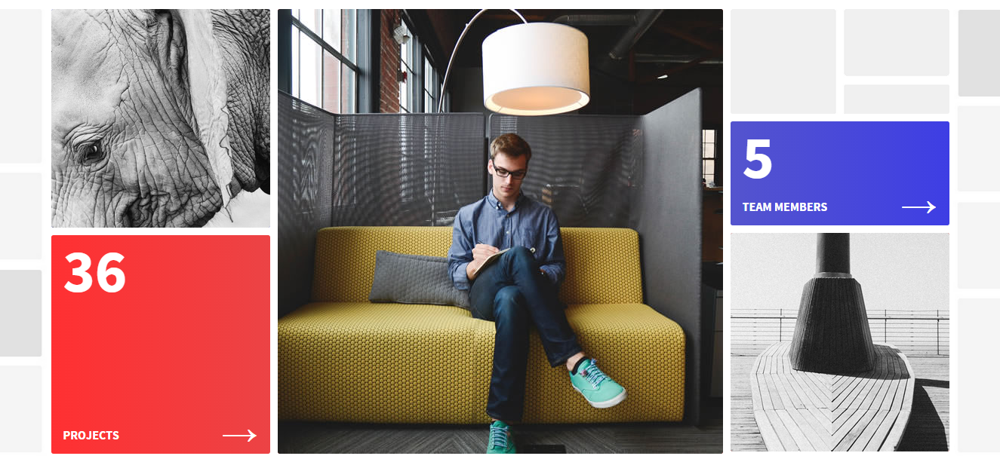
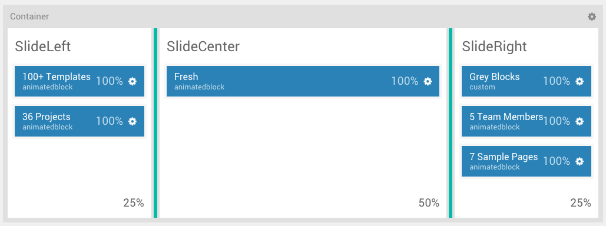
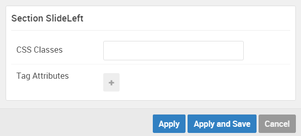
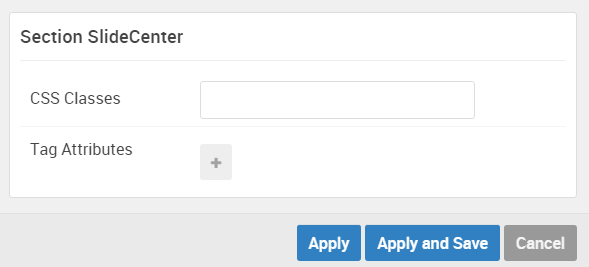
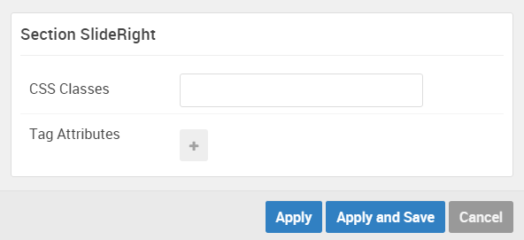

## Introduction

:	1. **Animated Block (Particle) 1** [5%, 5%, se]
	2. **Animated Block (Particle) 2** [50%, 5%, se]
	3. **Animated Block (Particle) 3** [5%, 30%, se]
	4. **Custom HTML (Particle)** [5%, 73%, se]
	5. **Animated Block (Particle) 4** [25%, 73%, se]
	6. **Animated Block (Particle) 5** [50%, 73%, se]

The **Slideshow** section includes six particles.

Here is a breakdown of the widget(s) and particle(s) that appear in these sections:

* SlideLeft
	* [Animated Block (particle) 1](#animated-block-(particle)-1)
	* [Animated Block (particle) 2](#animated-block-(particle)-2)
* SlideCenter
	* [Animated Block (particle) 3](#animated-block-(particle)-3)
* SlideRight
	* [Custom HTML (particle)](#custom-html-(particle))
	* [Animated Block (particle) 4](#animated-block-(particle)-4)
	* [Animated Block (particle) 5](#animated-block-(particle)-5)

## Section Settings

| Option         | Setting   |
| :-----         | :-----    |
| Section Width  | `25%`     |
| Layout         | Fullwidth |
| CSS Classes    | Blank     |
| Tag Attributes | Blank     |

| Option         | Setting   |
| :-----         | :-----    |
| Section Width  | `50%`     |
| Layout         | Fullwidth |
| CSS Classes    | Blank     |
| Tag Attributes | Blank     |

| Option         | Setting   |
| :-----         | :-----    |
| Section Width  | `25%`     |
| Layout         | Fullwidth |
| CSS Classes    | Blank     |
| Tag Attributes | Blank     |

## Animated Block (Particle) 1

We used a **Animated Block** particle to make up this area of the front page.

You will find the particle settings used in this particle below:

### Particle Settings

| Option           | Setting          |
| :-----           | :-----           |
| Particle Name    | `100+ Themes` |
| CSS Classes      | Blank            |
| Background Color | Accent 2         |
| Animation        | Animation 1      |
| Headline         | Blank            |
| Image            | Custom           |
| Headline         | `100+`           |
| Description      | `Themes`      |
| Read More        | `&rarr;`         |
| Link             | `#`              |
| Button           | Blank            |
| Button Classes   | Blank            |

### Block Settings

| Option         | Setting      |
| :-----         | :-----       |
| CSS ID         | Blank        |
| CSS Classes    | Blank        |
| Variations     | `No Padding` |
| Tag Attributes | Blank        |
| Fixed Size     | Unchecked    |
| Block Size     | `100%`       |

## Animated Block (Particle) 2

We used a **Animated Block** particle to make up this area of the front page.

You will find the particle settings used in this particle below:

### Particle Settings

| Option           | Setting       |
| :-----           | :-----        |
| Particle Name    | `36 Projects` |
| CSS Classes      | Blank         |
| Background Color | Gradient 1    |
| Animation        | Animation 2   |
| Title            | Blank         |
| Image            | Custom        |
| Headline         | `36`          |
| Description      | `Projects`    |
| Read More        | `&rarr;`      |
| Link             | `#`           |
| Button           | `Join`        |
| Button Classes   | `button-4`    |

### Block Settings

| Option         | Setting      |
| :-----         | :-----       |
| CSS ID         | Blank        |
| CSS Classes    | Blank        |
| Variations     | `No Padding` |
| Tag Attributes | Blank        |
| Fixed Size     | Unchecked    |
| Block Size     | `100%`       |

## Animated Block (Particle) 3

We used a **Animated Block** particle to make up this area of the front page.

You will find the particle settings used in this particle below:

### Particle Settings

| Option           | Setting          |
| :-----           | :-----           |
| Particle Name    | `Fresh`           |
| CSS Classes      | Blank            |
| Background Color | Accent 1         |
| Animation        | Animation 1      |
| Title            | Blank            |
| Image            | Custom           |
| Headline         | `Fresh`          |
| Description      | `Simple & Clean` |
| Read More        | `&rarr;`         |
| Link             | `#`              |
| Button           | Blank            |
| Button Classes   | Blank            |

### Block Settings

| Option         | Setting      |
| :-----         | :-----       |
| CSS ID         | Blank        |
| CSS Classes    | Blank        |
| Variations     | `No Padding` |
| Tag Attributes | Blank        |
| Fixed Size     | Unchecked    |
| Block Size     | `100%`       |

#### Custom HTML (Particle)

We used a **Custom HTML** particle to make up this area of the front page.

You will find the settings used in this widget below:

### Widget Settings

| Option             | Setting       |
| :-----             | :-----        |
| Particle Name      | `Grey Blocks` |
| Process Shortcodes | Unchecked     |

### Custom HTML

~~~ .html

~~~

### Block Settings

| Option         | Setting                         |
| :-----         | :-----                          |
| CSS ID         | Blank                           |
| CSS Classes    | `g-animateblock` `hidden-phone` |
| Variations     | `No Padding`                    |
| Tag Attributes | Blank                           |
| Fixed Size     | Unchecked                       |
| Block Size     | `100%`                            |

## Animated Block (Particle) 4

We used a **Animated Block** particle to make up this area of the front page.

You will find the particle settings used in this particle below:

### Particle Settings

| Option           | Setting          |
| :-----           | :-----           |
| Particle Name    | `5 Team Members` |
| CSS Classes      | Blank            |
| Background Color | Gradient 2       |
| Animation        | Animation 3      |
| Title            | Blank            |
| Image            | Custom           |
| Headline         | `5`              |
| Description      | `Team Members`   |
| Read More        | `&rarr;`         |
| Link             | `#`              |
| Button           | `Hire`           |
| Button Classes   | `button-4`       |

### Block Settings

| Option         | Setting      |
| :-----         | :-----       |
| CSS ID         | Blank        |
| CSS Classes    | Blank        |
| Variations     | `No Padding` |
| Tag Attributes | Blank        |
| Fixed Size     | Unchecked    |
| Block Size     | `100%`       |

## Animated Block (Particle) 5

We used a **Animated Block** particle to make up this area of the front page.

You will find the particle settings used in this particle below:

### Particle Settings

| Option           | Setting          |
| :-----           | :-----           |
| Particle Name    | `7 Sample Pages` |
| CSS Classes      | Blank            |
| Background Color | Accent 3         |
| Animation        | Animation 1      |
| Title            | Blank            |
| Image            | Custom           |
| Headline         | `7`              |
| Description      | `Sample Pages`   |
| Read More        | `&rarr;`         |
| Link             | `#`              |
| Button           | Blank            |
| Button Classes   | Blank            |

### Block Settings

| Option         | Setting      |
| :-----         | :-----       |
| CSS ID         | Blank        |
| CSS Classes    | Blank        |
| Variations     | `No Padding` |
| Tag Attributes | Blank        |
| Fixed Size     | Unchecked    |
| Block Size     | `100%`       |