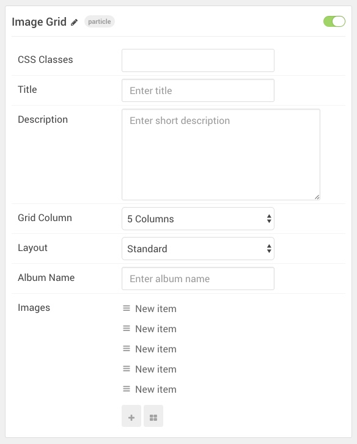

## Introduction

The **Image Grid** particle gives you the ability to quickly set up a clean, organized grid of images. This particle is perfect for image portfolios and galleries. 

Here are the topics covered in this guide:

* [Layout](#layout)
    - [Particle Content](#particle-content)
* [Configuration](#configuration)
    - [Main Options](#main-options)
    - [Item Options](#item-options)

>> Note: You will need the [RokBox](http://www.rockettheme.com/wordpress/extensions/rokbox) extension installed and active to take advantage of the click-to-view feature.

## Layout

In Sienna, the **Image Grid** particle is a beautiful way to display image. It has a sleek, simple layout. Clicking on an image brings up a popup with the full-size image and a simple left-right navigation.

### Particle Content

:   1. **Item - Promo Image** [3%, 22%, se]
    2. **Item - Promo Image** [3%, 1%, se]
    3. **Item - Caption** [40%, 6%, se]

## Configuration

### Main Options 

These options affect the main area of the particle, and not the individual items within.

| Option        | Description                                                                                 |
| :-----        | :-----                                                                                      |
| Particle Name | Enter the name you would like to assign to the particle. This only appears in the back end. |
| CSS Classes   | Enter the CSS class(es) you want to use in the content of the particle.                     |
| Title         | Enter a title for the particle.                                                             |
| Description   | Enter a description for your particle.                                                      |
| Grid Column   | Enter the number of columns you would like to have items displayed in.                      |
| Album Name    | Enter a name for the album of images featured in the particle's items.                      |

### Item Options

These items make up the individual featured items in the particle.

| Option      | Description                                                                                   |
| :-----      | :-----                                                                                        |
| Item Name   | Enter the name you would like to assign to the item. This only appears in the back end.       |
| Promo Image | Point the item to the image you wish to have featured in this item.                           |
| Caption     | Add a caption to the image. This caption appears when the image is selected on the front end. |

