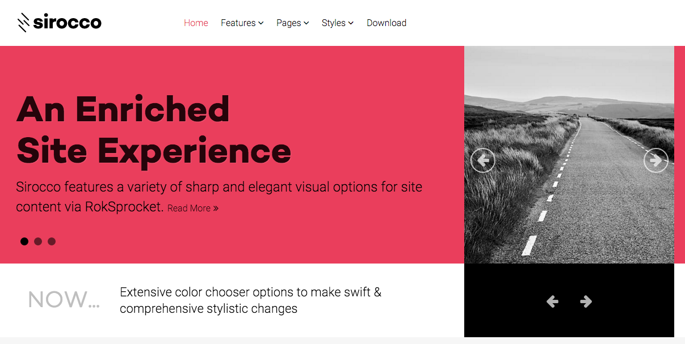
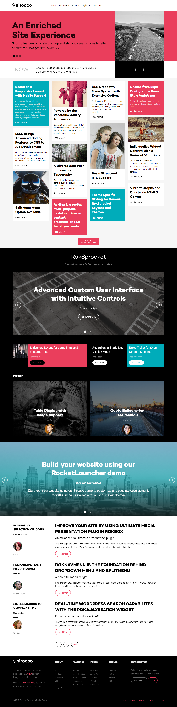

Introduction
-----

Recreating features of the demo site used to show off some of the more interesting aspects of Sirocco can be done fairly easily. All you need is the right plugins and settings, and you should be able to reproduce most (if not all) of the elements found in our demo site.

Below, we will break down some of these elements and give you the information you need to know to recreate them on your own site using the Sirocco theme.

Keep in mind that a lot of the detail that makes our demos look so good are the result of many hours of hard work by our team, and some of them will require a moderate level of experience working with the WordPress back end. We have added most of these elements into the theme's core files in order to make them easily accessible without having to edit any code.

Recommended Plugins
-----

Here is a list of RocketTheme plugins used to create the demo version of Sirocco:

* [Gantry Framework](http://gantry.org/downloads)
* [RokAjaxSearch](http://www.rockettheme.com/wordpress/plugins/rokajaxsearch)
* [RokBox](http://www.rockettheme.com/wordpress/plugins/rokbox)
* [RokCommon Library](http://www.rockettheme.com/wordpress/plugins/rokutilities) (Should be Installed and Activated Before RokGallery and/or RokSprocket)
* [RokSprocket](../../plugins/roksprocket/)

All of these plugins are included with the Sirocco RocketLauncher, and can be downloaded and installed individually by going to the RocketTheme website.

Recreating the Front Page
-----

The front page of the Sirocco demo sits apart from the rest of the page layouts in that it features the latest and greatest features used in the theme. It is because of this that several widget and layout overrides were done. In this section, we will break down the settings you will need to recreate elements present in the front page of the Sirocco theme.

For the front page, we used a **Page Suffix** to load the unique styling for it. You will need to create a **Front Page** override under **Theme Settings**. To get to this page, navigate to **Admin > Sirocco Settings**. Once you have done that, simply select the **Gizmos** panel (tab) and enter the following in the **Page Suffix** field: `rt-menu-home -rt-sirocco-style`. 

Once this is done, you will need to assign the **Front Page** override to the page. You can find more details about this [assignment here](demo_override.md#assignments).

Theme Settings
-----

The first thing you will need to do in order to set your front page apart as it appears in the demo is to create a setting override. This can be done by navigating to **Administrative Dashboard -> Sirocco Theme** and selecting the **+** icon located just above the **Style** settings tab.

It would be a good idea for organization to name this layout override something like **Front Page** as it would be used only for the front page of your site.

#### Assignments

The next step you will need to take in creating your Theme Settings override is to assign the Front Page override to the page you wish to use as the home page. Under the **Template Page Types** list, you will want to select your desired page.

Doing this will assign the override to this page. This will allow the override to cover all access scenarios that would lead a user to your site's main home page.

You can find more information about the entire override breakdown for both the front page and our default settings in the demo by visiting the [override portion](demo_override.md) of this tutorial.

Widget Settings
-----

:   1. **Header - Gantry Logo** [1%, 5%, se]
    2. **Header - Gantry Menu** [1%, 25%, se]
    3. **Showcase - RokSprocket (Features)** [2%, 3%, se]
    4. **Utility - RokSprocket (Headlines)** [10%, 8%, se]
    5. **Feature - RokSprocket (Mosaic)** [12%, 8%, se]
    6. **Main Top - Text** [36%, 40%, se]
    7. **Expanded Top - RokSprocket (Features)** [39%, 8%, se]
    8. **Expanded Bottom - Text** [48%, 8%, se]
    9. **Main Bottom - Text** [53%, 8%, se]
    10. **ThirdFullWidth - RokSprocket (Features)** [63%, 8%, se]
    11. **Sidebar - Text** [74%, 8%, se]
    12. **MainBody** [74%, 80%, sw]
    13. **Footer - Text** [94%, 8%, se]
    14. **Footer - Text** [94%, 32%, se]
    15. **Footer - Text** [94%, 70%, se]
    16. **Copyright - Gantry Copyright** [99%, 8%, se]
    17. **Copyright - Menu** [99%, 65%, se]

Like any Gantry theme, Sirocco utilizes widget overrides to allow different widget placements for various areas of your WordPress site. This makes it possible to not only utilize the full power of the Gantry framework, but to make each area of your site uniquely suited to meet your user's needs.

Below, you will find the widget placement and settings for the various widget positions as they appear in the Front Page widget override. Not all of these positions were overwritten. Some positions (such as the Header section) are often set in the primary default widget setting.

One important thing to note here is that many of the widget sections included in our demo are split up using a **Gantry Divider** widget. This widget tells WordPress to start a new widget column beginning with the widget placed directly below the divider in the section. You will see the Gantry Divider in any widget section breakdowns as they are included in the demo.

### Widget Sections

* [Header](demo_header.md)
* [Showcase](demo_showcase.md)
* [Utility](demo_utility.md)
* [Feature](demo_feature.md)
* [Main Top](demo_maintop.md)
* [Expanded Top](demo_expandedtop.md)
* [Expanded Bottom](demo_expandedbottom.md)
* [Main Bottom](demo_mainbottom.md)
* [ThirdFullWidth](demo_thirdfullwidth.md)
* [Sidebar](demo_sidebar.md)
* [MainBody](demo_mainbody.md)
* [Footer](demo_footer.md)
* [Copyright](demo_copyright.md)
