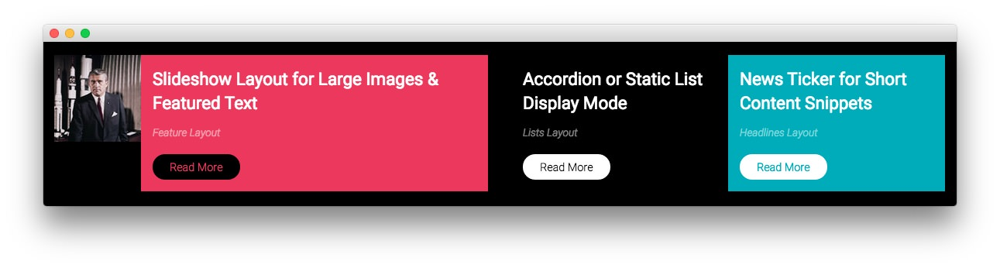

Expanded Bottom Section
-----

Here is the widget breakdown for the Expanded Bottom section:

#### Text

This section of the page is a standard text widget. You will need to enter the following in the main text field.

~~~ .html

    

        

            

                

                    
                

                

                    

                        <h2>Slideshow Layout for Large Images &amp; Featured Text</h2>
                        Feature Layout
                        <a href="http://demo.rockettheme.com/live/wordpress/sirocco/features-overview/" class="readon">Read More</a>                        
                    

                

            

        
  
        

            

                

                    

                        <h2>Accordion or Static List Display Mode</h2>
                        Lists Layout
                        <a href="http://demo.rockettheme.com/live/wordpress/sirocco/features-overview/" class="readon">Read More</a>                        
                    

                

                

                    

                        <h2>News Ticker for Short Content Snippets</h2>
                        Headlines Layout
                        <a href="http://demo.rockettheme.com/live/wordpress/sirocco/features-overview/" class="readon">Read More</a>                        
                    

                

            

        
          
    

~~~

Here is a breakdown of options changes you will want to make to match the demo.

| Option            | Setting                                |
| :---------------- | :---------                             |
| Custom Variations | `fp-expandedbottom rt-title-uppercase` |

Leaving everything else at its default setting, select **Save**.
