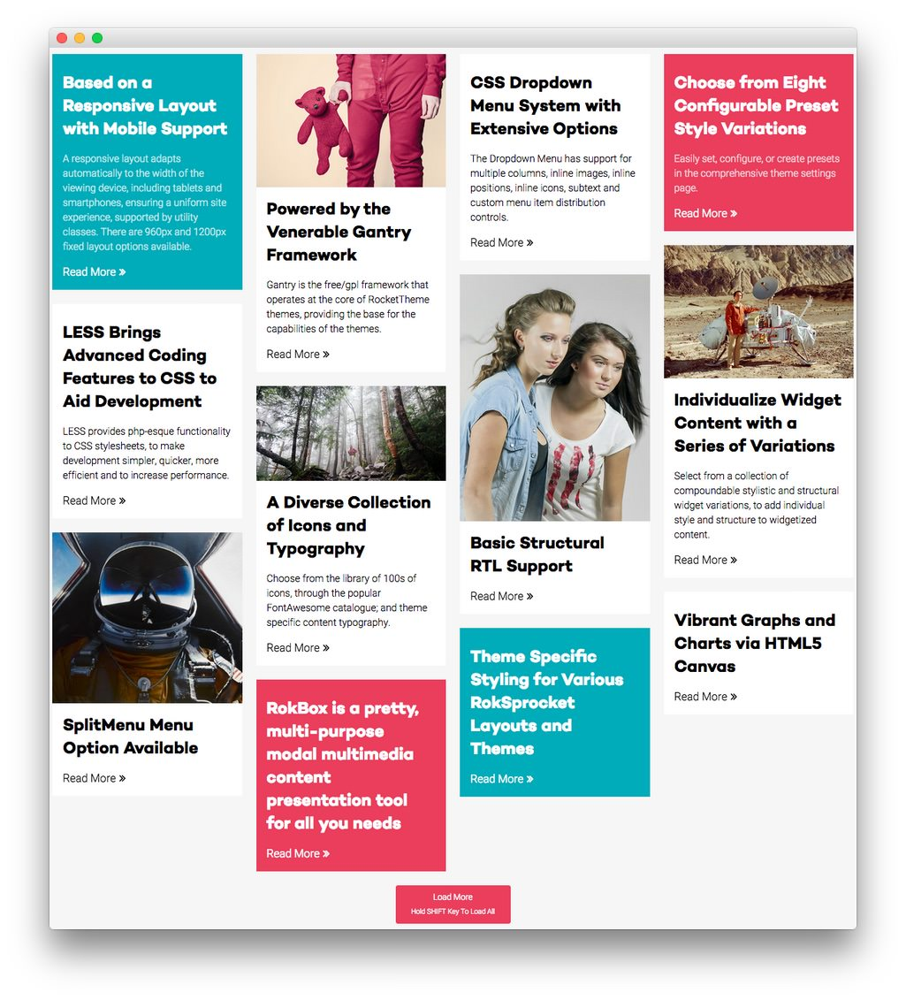

Feature Section
-----

Here is the widget breakdown for the Feature section:

#### RokSprocket (Mosaic)

This area of the demo is a RokSprocket widget. You will need to do two things to prepare this widget so that it looks similar to the one in the demo.

First, you will need to create the RokSprocket Widget. You can do this by navigating to **Administration -> RokSprocket Admin** and creating a new **Mosaic** widget.

You can find out more about RokSprocket and how to set up and modify widgets by visiting our [RokSprocket documentation](../../plugins/roksprocket).

**Simple Content Provider**

We used the **Simple Provider** to enable us to create custom RokSprocket content without having to create separate articles or pages to do so. Here are the details of one of the **Simple Items** in the **Featured Article List**.

| Option | Setting                                            |
| :----- | :-----                                             |
| Title  | `Based on a Responsive Layout with Mobile Support` |
| Image  | Custom                                             |
| Link   | Custom                                             |

**Description**

~~~ .html
A responsive layout adapts automatically to the width of the viewing device, including tablets and smartphones, ensuring a uniform site experience, supported by utility classes. There are 960px and 1200px fixed layout options available.
~~~

Here is a look at the **Mosaic Layout Options** for this widget.

| Option          | Setting                      |
| :-------------- | :--------------------------- |
| Theme           | Default                      |
| Display Limit   | ∞                            |
| Columns         | 4                            |
| Preview Length  | ∞                            |
| Only Show Tags  |                              |
| Strip HTML Tags | No                           |
| Blocks Per View | 12                           |
| Article Details | Hide Author and Date         |
| Block Animation | Fade, Scale, Rotate          |
| Ordering        | Default, Title, Date, Random |
| Image Resize    | Disable                      |

Once you have created this widget, you can add it via the Widgets menu by clicking **RokSprocket** and dragging it to the appropriate section. When you have done this, you will need to open the Widget's settings and fill them out as noted below:

| Option            | Setting                                          |
| :-----            | :-----                                           |
| Choose Widget     | (Select the RokSprocket Widget You Just Created) |
| Custom Variations | `fp-roksprocket-mosaic`                          |

Leaving everything else at its default setting, select **Save**.
