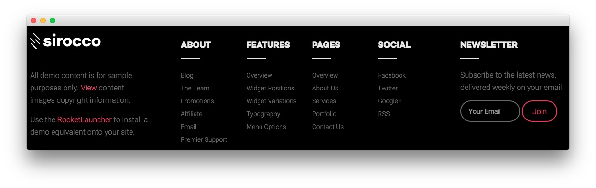

Footer Section
-----

:   1. **Text 1** [20%, 5%, se]
    2. **Text 2** [20%, 30%, se]
    3. **Text 3** [20%, 75%, se]

Here is the widget breakdown for the Footer section:

* Text
* Gantry Divider
* Text
* Gantry Divider
* Text

#### Text 1

This section of the page is a standard text widget. You will need to enter the following in the main text field.

~~~ .html

 

All demo content is for sample purposes only. <a data-rokbox data-rokbox-element="#rt-copyright-modal" href="#">View</a> content images copyright information.

 Use the <a href="http://www.rockettheme.com/wordpress/themes/sirocco">RocketLauncher</a> to install a demo equivalent onto your site.

    

        
Below are links to the individual or repository sources for the content images used in the Sirocco Demo:

        <ul>
            <li><a href="http://www.unsplash.com">http://www.unsplash.com</a></li>
            <li><a href="http://www.pexels.com/photo/3158/">http://www.pexels.com/photo/3158/</a></li>
            <li><a href="http://picography.co/photos/long-road-ahead/">http://picography.co/photos/long-road-ahead/</a></li>
            <li><a href="http://en.wikipedia.org/wiki/File:Sagan_Viking.jpg">http://en.wikipedia.org/wiki/File:Sagan_Viking.jpg</a></li>
            <li><a href="http://en.wikipedia.org/wiki/File:Brian_Shul_in_the_cockpit_of_the_SR-71_Blackbird.jpg">http://en.wikipedia.org/wiki/File:Brian_Shul_in_the_cockpit_of_the_SR-71_Blackbird.jpg</a></li>
            <li><a href="http://en.wikipedia.org/wiki/File:Wernher_von_Braun.jpg">http://en.wikipedia.org/wiki/File:Wernher_von_Braun.jpg</a></li>
            <li><a href="http://www.splashbase.co/images">http://www.splashbase.co/images</a></li>
            <li><a href="http://www.gratisography.com/">http://www.gratisography.com/</a></li>
            <li><a href="http://pixabay.com/pt/o-kremlin-rio-inverno-moscou-610025/">http://pixabay.com/pt/o-kremlin-rio-inverno-moscou-610025/</a></li>
            <li><a href="http://pixabay.com/pt/meninas-dois-mulheres-retrato-487062/">http://pixabay.com/pt/meninas-dois-mulheres-retrato-487062/</a></li>
            <li><a href="http://picography.co/photos/statue/">http://picography.co/photos/statue/</a></li>
            <li><a href="https://randomuser.me/photos">https://randomuser.me/photos</a></li>
        </ul>
    

~~~

Here is a breakdown of options changes you will want to make to match the demo.

| Option            | Setting       |
| :-----            | :-----        |
| Custom Variations | `fp-footer-a` |

Leaving everything else at its default setting, select **Save**.

#### Gantry Divider

This widget tells WordPress to start a new widget column beginning with the widget placed directly below the divider in the section.

#### Text 2

This section of the page is a standard text widget. You will need to enter the following in the main text field.

~~~ .html

    

        

            <h5>About</h5>
            <ul class="rt-noliststyle">
                <li><a href="http://www.rockettheme.com/blog">Blog</a></li>
                <li><a href="http://www.rockettheme.com/the-team">The Team</a></li>
                <li><a href="http://www.rockettheme.com/promotions">Promotions</a></li>
                <li><a href="http://www.shareasale.com/shareasale.cfm?merchantID=30300">Affiliate</a></li>
                <li><a href="http://www.rockettheme.com/contact-us">Email</a></li>
                <li><a href="http://www.rockettheme.com/purchase-premier-support">Premier Support</a></li>
            </ul>                       
        

    

    

        

            <h5>Features</h5>
            <ul class="rt-noliststyle">
                <li><a href="http://demo.rockettheme.com/live/wordpress/sirocco/features-overview/">Overview</a></li>
                <li><a href="http://demo.rockettheme.com/live/wordpress/sirocco/widget-positions/">Widget Positions</a></li>
                <li><a href="http://demo.rockettheme.com/live/wordpress/sirocco/widget-variations/">Widget Variations</a></li>
                <li><a href="http://demo.rockettheme.com/live/wordpress/sirocco/typography/">Typography</a></li>
                <li><a href="http://demo.rockettheme.com/live/wordpress/sirocco/menu-options/">Menu Options</a></li>
            </ul>       
        

    

    
       
        

            <h5>Pages</h5>
            <ul class="rt-noliststyle">
                <li><a href="http://demo.rockettheme.com/live/wordpress/sirocco/pages-overview/">Overview</a></li>
                <li><a href="http://demo.rockettheme.com/live/wordpress/sirocco/about-us/">About Us</a></li>
                <li><a href="http://demo.rockettheme.com/live/wordpress/sirocco/services/">Services</a></li>
                <li><a href="http://demo.rockettheme.com/live/wordpress/sirocco/portfolio/">Portfolio</a></li>
                <li><a href="http://demo.rockettheme.com/live/wordpress/sirocco/contact-us/">Contact Us</a></li>                
            </ul>       
        

    
  
    
       
        

            <h5>Social</h5>
            <ul class="rt-noliststyle">
                <li><a href="https://www.facebook.com/RocketTheme">Facebook</a></li>
                <li><a href="https://twitter.com/rockettheme">Twitter</a></li>
                <li><a href="https://plus.google.com/+rockettheme/posts">Google+</a></li>
                <li><a href="http://www.rockettheme.com/product-updates?rss">RSS</a></li>
            </ul>   
        

    
              

  
~~~

Here is a breakdown of options changes you will want to make to match the demo.

| Option            | Setting                    |
| :-----            | :-----                     |
| Custom Variations | `fp-footer-b hidden-phone` |

Leaving everything else at its default setting, select **Save**.

#### Text 3

This section of the page is a standard text widget. You will need to enter the following in the main text field.

~~~ .html

Subscribe to the latest news, delivered weekly on your email.

<form class="fp-bottom-form" onsubmit="window.open('http://feedburner.google.com/fb/a/mailverify?uri=rocketthemeblog', 'popupwindow', 'scrollbars=yes,width=550,height=520');return true" target="popupwindow" method="post" action="http://feedburner.google.com/fb/a/mailverify">
    <input type="text" name="email" class="inputbox" placeholder="Your Email" />
    <input type="hidden" name="uri" value="rocketthemeblog" />
    <input type="hidden" value="en_US" name="loc" />
    <input type="submit" value="Join" class="readon" name="Submit" />
</form>
~~~

Here is a breakdown of options changes you will want to make to match the demo.

| Option            | Setting                           |
| :-----            | :-----                            |
| Title             | `Newsletter`                      |
| Custom Variations | `fp-footer-c title5 hidden-phone` |

Leaving everything else at its default setting, select **Save**.
