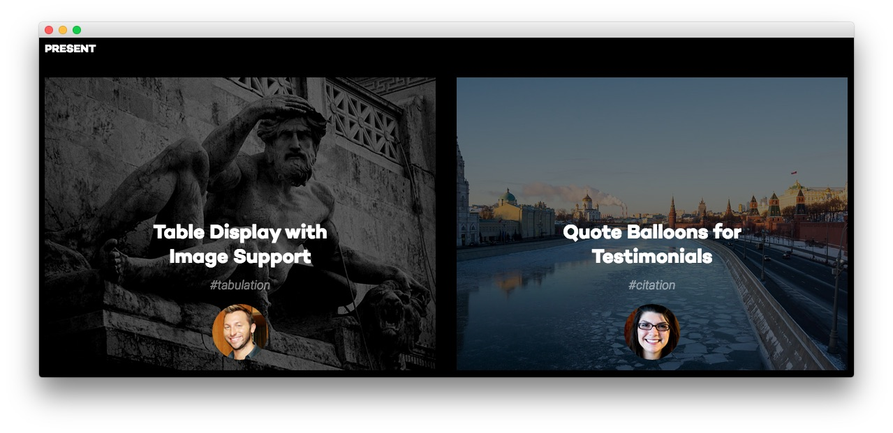

Main Bottom Section
-----

Here is the widget breakdown for the Main Bottom section:

#### Text

This section of the page is a standard text widget. You will need to enter the following in the main text field.

~~~ .html

    

        

            

                

                    

                        
                    

                    

                        

                            <h2 class="title">Table Display with 
Image Support
</h2>
                            #tabulation       
                                         
                        

                    
          
                

            

        
  
        

            

                

                    

                        
                    

                    

                        

                            <h2 class="title">Quote Balloons for 
Testimonials
</h2>
                            #citation     
                                             
                        

                    
          
                

            

        
          
    

~~~

Here is a breakdown of options changes you will want to make to match the demo.

| Option            | Setting                            |
| :---------------- | :---------                         |
| Title             | `Present`                          |
| Custom Variations | `fp-mainbottom rt-title-uppercase` |

Leaving everything else at its default setting, select **Save**.
