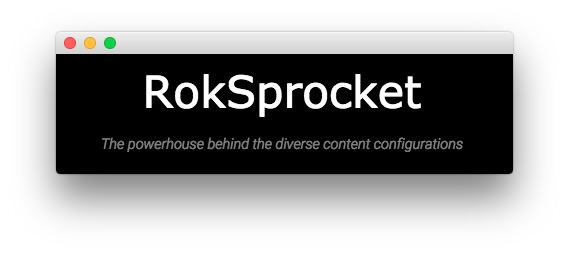

Main Top Section
-----

Here is the widget breakdown for the Main Top section:

#### Text

This section of the page is a standard text widget. You will need to enter the following in the main text field.

~~~ .html
<h2>RokSprocket</h2>
The powerhouse behind the diverse content configurations
~~~

Here is a breakdown of options changes you will want to make to match the demo.

| Option            | Setting      |
| :---------------- | :---------   |
| Widget Variations | RT-Center    |
| Custom Variations | `fp-maintop` |

Leaving everything else at its default setting, select **Save**.
