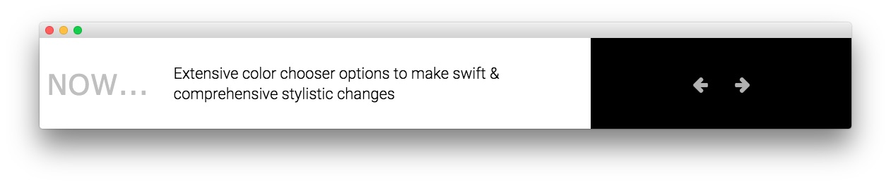

Utility Section
-----

Here is the widget breakdown for the Utility section:

#### RokSprocket (Headlines)

You will need to do two things to prepare this widget so that it looks similar to the one in the demo.

First, you will need to create the RokSprocket Widget. You can do this by navigating to **Administration -> RokSprocket Admin** and creating a new **Headlines** widget.

You can find out more about RokSprocket and how to set up and modify widgets by visiting our [RokSprocket documentation](../../plugins/roksprocket/).

##### Simple Provider

We used the **Simple Provider** to enable us to create custom headline text without having to create separate posts or pages to do so. Here are the details of one of the items in the **Featured Article List**.

| Option      | Setting                                                                               |
| :---------- | :----------                                                                           |
| Image       | None                                                                                  |
| Link        | None                                                                                  |
| Description | `Extensive color chooser options to make swift &amp; comprehensive stylistic changes` |

Here is a look at the **Headlines Layout Options** for this widget.

| Option           | Setting        |
| :----------      | :----------    |
| Theme            | Default        |
| Display Limit    | ∞              |
| Label Text       | `Now...`       |
| Preview Length   | ∞              |
| Strip HTML Tags  | No             |
| Arrow Navigation | Show           |
| Animation        | Slide and Fade |
| Autoplay         | Disable        |
| Autoplay Delay   | 5              |
| Image Resize     | Disable        |

You can set the RokSprocket filters to include any category, specific posts, or otherwise you would like to have featured in this widget.

Once you have created this widget, you can add it via the Widgets menu by clicking **RokSprocket** and dragging it to the appropriate section. When you have done this, you will need to return to the Widgets settings and fill them out as noted below:

| Option            | Setting                                          |
| :-----            | :-----                                           |
| Choose Widget     | (Select the RokSprocket Widget You Just Created) |
| Custom Variations | `fp-roksprocket-headlines`                       |

Leaving everything else at its default setting, select **Save**.