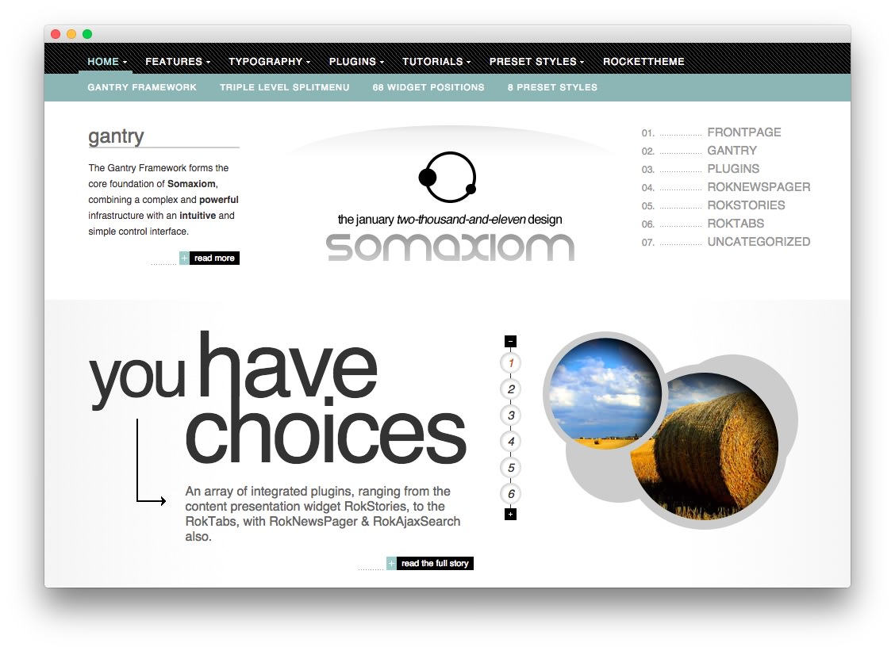
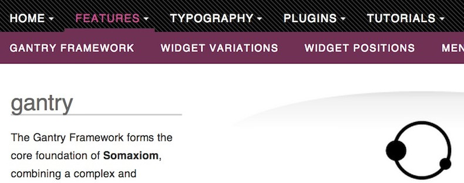
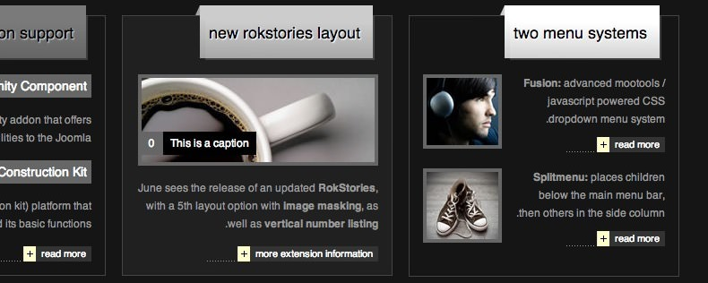

Introduction
------------

Somaxiom concentrates on design elegance. The visuals are refined, making the appearance suitable for many different sites, as well as providing a base for individualization. The theme supports custom image overlays to add detail to otherwise minimalistic elements.

Requirements
------------

* Gantry 4 Framework
* FF, Safari, Chrome, Opera, IE8+
* PHP 5.4+
* WordPress 5.x

> > NOTE: An updated version of RokCommon is required for Somaxiom to work properly. For more details on the Gantry Framework, please visit its [Dedicated Website](http://www.gantry.org/).

Key Features
------------

* 960 Fixed Layout
* 8 Preset Styles
* 68 Widget Positions
* 11 Widget Variations
* Fusion-Menu and Split-Menu
* Custom Typography
* iPhone Theme
* iPhone Menu

### Fusion/SplitMenu

There are two menu options, SplitMenu and Fusion Menu. The Splitmenu is a static menu system that displays select menu items in a main horizontal menu. The Fusion Menu is an advanced, CSS based menu system, which offers a wide range of per menu options.

### RTL Support

Theme side RTL support from the Fusion menu to the Typography. This is in conjunction with Gantry's RTL support for the automatic flipping of the grid system. If an RTL language is enabled in WordPress, the theme will automatically adjust to the RTL layout.
