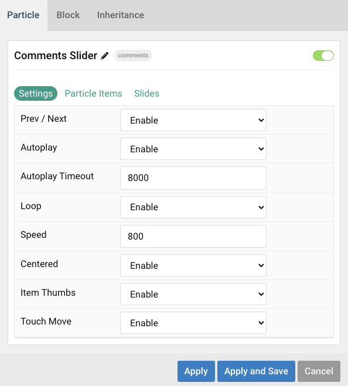
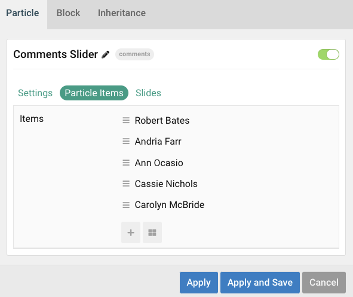
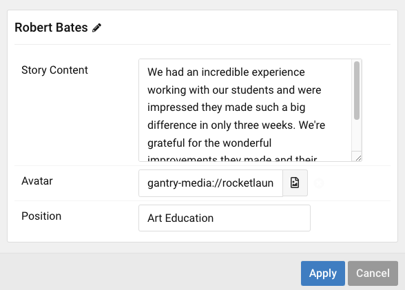

## Introduction

The **Comments Slider** particle creates a grid of user comments/testimonials, including text content, avatar, name and position.

Here are the topics covered in this guide:

* [Configuration](#configuration)
    - [Main Options](#main-options)
    - [Item Options](#item-options)
    - [Articles](#articles)
    - [Display](#display)

## Configuration

### Main Options 

These options affect the main area of the particle, and not the individual items within. You can set the title of the particle, as well as give it an introductory paragraph here.

| Option        | Description                                                                     |
| :-----        | :-----                                                                          |
| Particle Name | Give the particle a name. This only appears on the backend.                     |
| Autoplay         | **Enable** or **Disable** autoplay.                                                                 |
| Autoplay Timeout | Enter (in milliseconds) the delay between automatic switching between items.                        |
| Loop             | **Enable** or **Disable** looping of items.                                                         |
| Speed            | Set the transition speed (in milliseconds).                                                         |
| Centered              | **Enable** or **Disable** centered slides.                                                                      |
| Item Thumbs           | **Enable** or **Disable** slider thumbnails.                                                                    |
| Touch Move            | **Enable** or **Disable** touch movements.                                                                      |

### Item Options

These items make up the individual featured items in the particle. They sit apart from the particle's title and introduction. Each item can have its own properties, including icons and written content.

| Option              | Description                                                            |
| :-----              | :-----                                                                 |
| Story Content | Enter text content that makes up the quote or body of the testimonial/comment. |
| Avatar               | Pick desired avatar.                                  |
| Position            | Work position.                                    					|

