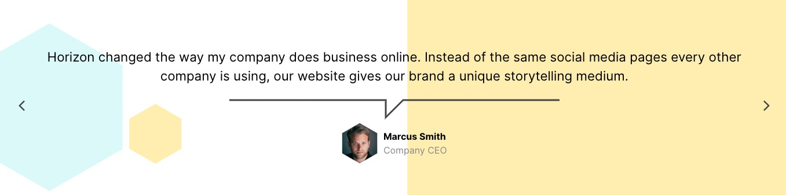
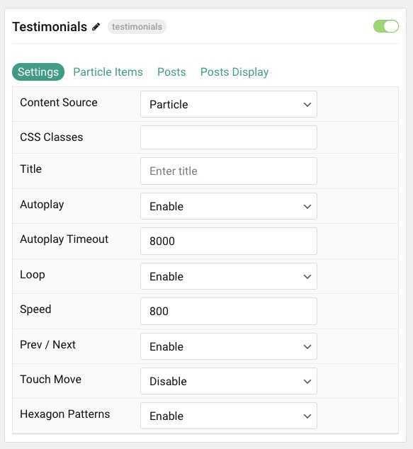
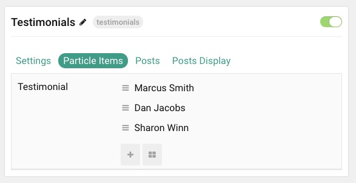
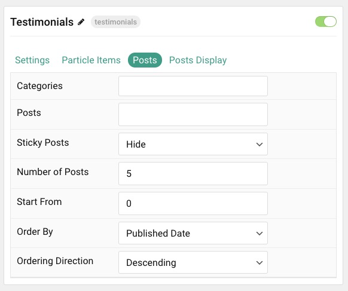
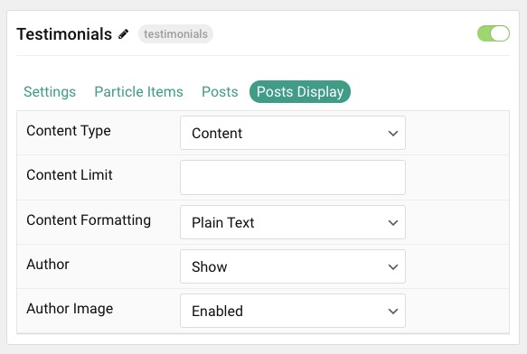

## Introduction

The **Testimonials** particle creates a grid of testimonials, including text content, logo, and alt text.

Here are the topics covered in this guide:

* [Configuration](#configuration)
    - [Main Options](#main-options)
    - [Item Options](#item-options)
    - [Posts](#posts)
    - [Display](#display)

## Configuration

### Main Options 

These options affect the main area of the particle, and not the individual items within. You can set the title of the particle, as well as give it an introductory paragraph here.

| Option        | Description                                                                     |
| :-----        | :-----                                                                          |
| Particle Name | Give the particle a name. This only appears on the backend.                     |
| Content Source   | Choose between **Particle** and **WordPress** as the content source.                                   |
| CSS Classes      | Enter any CSS class(es) you wish to have apply to the particle.                                     |
| Title            | Enter a title for the particle. This will appear on the front end.                                  |
| Autoplay         | **Enable** or **Disable** autoplay.                                                                 |
| Autoplay Timeout | Enter (in milliseconds) the delay between automatic switching between items.                        |
| Loop             | **Enable** or **Disable** looping of items.                                                         |
| Speed            | Set the transition speed (in milliseconds).                                                         |
| Prev / Next      | **Enable** or **Disable** the prev / next navigation.                                               |
| Touch Move       | **Enable** or **Disable** touch movements                                          |
| Hexagon Patterns | **Enable** or **Disable** hexagon background patterns.                                                         |

### Item Options

These items make up the individual featured items in the particle. They sit apart from the particle's title and introduction. Each item can have its own properties, including icons and written content.

| Option              | Description                                                            |
| :-----              | :-----                                                                 |
| Testimonial Content | Enter text content that makes up the quote or body of the testimonial. |
| Photo               | Pick desired photo.                                  |
| Position            | Work position.                                    					|

### Posts

| Option             | Description                                                                            |
| :-----             | :-----                                                                                 |
| Categories         | Select the categories of posts this particle will display.                             |
| Posts              | Select the number of posts you would like the particle to fetch.                       |
| Sticky Posts       | Choose to **Show** or **Hide** posts marked as **Sticky**.                             |
| Number of Posts    | Enter the maximum number of posts to display.                                          |
| Start From         | Enter offset specifying the first post to return. The default is '0' (the first post). |
| Order By           | Choose the type of factor to order by.                                                 |
| Ordering Direction | Choose between **Ascending** and **Descending** as the post ordering method.           |

### Display

This section configures how posts are displayed.

| Option             | Description                                                                                       |
| :-----             | :-----                                                                                            |
| Content Type       | Choose between showing the **Content** or **Exerpt** text to display. You can also **Hide** text. |
| Content Limit      | Set a limit (in characters) of the post's text to appear.                                         |
| Content Formatting | Select between **Plain Text** and **HTML** text formatting.                                       |
| Author             | **Enable** or **Disable** the image.                                               					 |
| Author Image       | **Show** or **Hide** the author.                                              |
