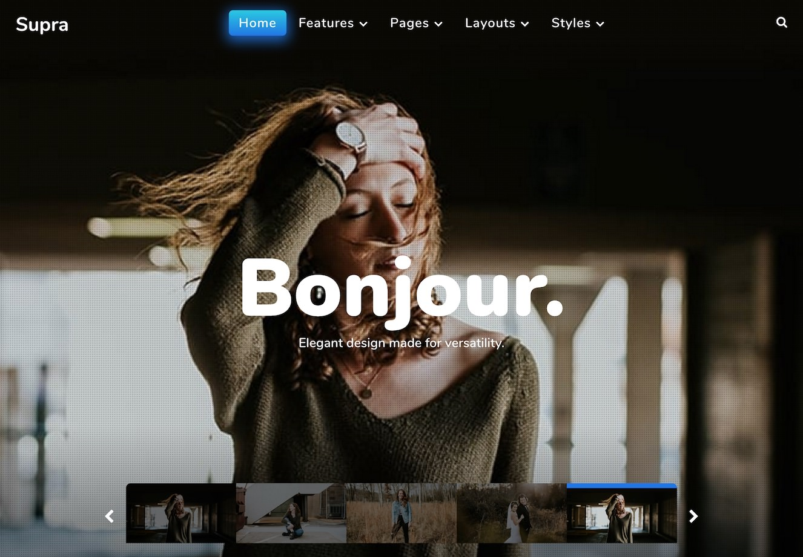

Introduction
-----

Supra is a powerhouse theme loaded with features and uncompromising in its versatility. Build beautiful background slideshows in seconds, and customize your site with over 25 powerful particles that make setting up a complete website a snap.

New to Gantry 5?
-----
If you are new to Gantry 5, a good place to start would be our [dedicated Gantry documentation](http://docs.gantry.org).

Requirements
-----

* PHP 7.1+
* Curl
* OpenSSL Libraries
* Multibyte String Support
* MySQL
* WordPress 4.7+

>> NOTE: Gantry 5.4.12+ is required for Supra to work correctly. For more details on the Gantry Framework, please visit its [Dedicated Website](http://gantry.org).

Key Features
-----

### Included Particles

* Accordion
* Content Tabs
* Grid Content
* Grid Statistic
* Image Grid
* Newsletter
* Panel Slider
* Popup Grid
* Pricing Table
* Simple Counter
* Slider
* Slideshow
* Video
* WordPress Posts 

### Theme Features

* Responsive Layout
* 5 Preset Styles
* Custom Typography
* Unlimited Positions
* Popup Particle
* Custom Particles
* Mobile Menu
* Coming Soon Page
* Font Awesome Icons 

### Gantry Core Features

* YAML-based Configuration
* Twig Templating
* Powerful Particle System
* Visual Menu Editor
* MegaMenu Support
* Off-Canvas Panel
* Ajax Admin
* Layout Manager
* Theme Inheritance
* Fluid Width Option
* Fixed Width Option
* SCSS Support
* Sophisticated Fields
* Unlimited Undo/Redo
* Styles Panel

## Typography

Typography is an important instrument in not only the site design, but how your content is portrayed and utilized by your visitors. Therefore, Supra offers a rich selection of elegant typography to provide focus to varying content types.

## Responsive

Supra is a responsive theme which means it adapts to the viewing device's width, such as mobile, tablet or desktop. Mobile modes have a unique menu to aid usability. Support classes can also be used to display or hide various types of content for each device.

## Inheritance

Supra takes full advantage of Gantry’s new inheritance system, making it easier than ever to configure and manage your website through synced particles, atoms, sections, and layouts. Save time by using inheritance to avoid repetitive changes!
