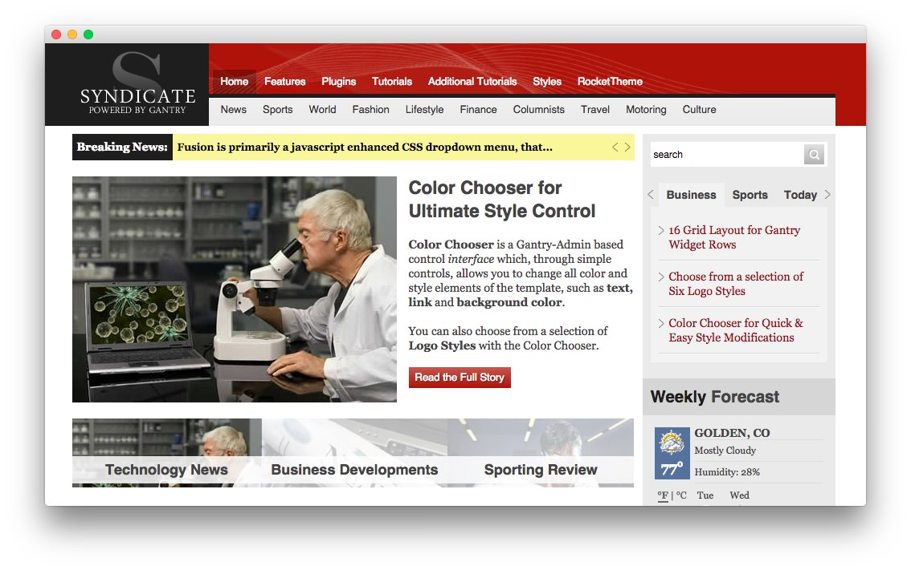
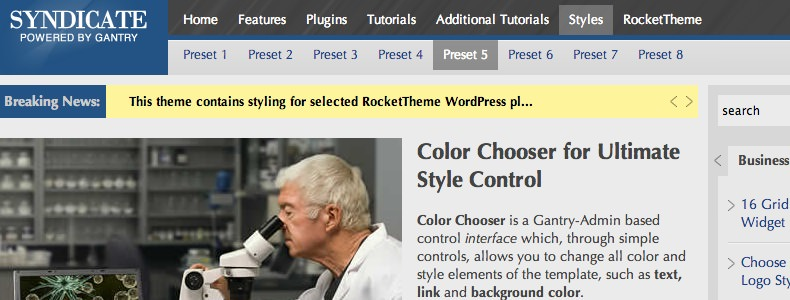

Introduction
------------

Syndicate is perfect for any news, media or business type site that requires a clean, conservative but advanced design. The Color Chooser makes the theme incredibly adaptable, alongside its 8 presets, 6 logo options, and 49 widget variation combinations.

Requirements
------------

* Gantry 4 Framework
* FF, Safari, Chrome, Opera, IE8+
* PHP 5.2.17+ (5.3+ recommended)
* WordPress 3.2+, 4.0+

> > NOTE: An updated version of RokCommon is required for Syndicate to work properly. For more details on the Gantry Framework, please visit its [Dedicated Website](http://www.gantry-framework.org/).

Key Features
------------

* 960 Fixed Layout
* 8 Preset Styles
* 76 Widget Positions
* 20 Widget Variations
* Fusion-Menu and Split-Menu
* Custom Typography
* iPhone Theme
* iPhone Menu

### 16 Grid Layout

Gantry offers a grid system, splitting widget position rows into blocks of up to 6 widgets, side by side. Their widths can be adjusted in the administrator. This is based off of a figure of 12, such as 4|4|4, but with Syndicate, this is 16, allowing for more precision such as 6|6|4.

### Split/Fusion Menu

Syndicate has two menu options, SplitMenu and Fusion Menu. The Splitmenu is a static menu system that displays select menu items in a main horizontal menu. The Fusion Menu is an advanced, CSS based menu system, which offers a wide range of per menu options.
