## Introduction

:   1. **Logo / Image (Particle)** [7%, 2%, se]
    2. **Social (Particle)** [7%, 16%, se]
    3. **Menu (Particle)** [7%, 45%, se]
    4. **Search (Widget)** [7%, 78%, se]
    5. **WordPress Articles (Particle)** [30%, 15%, se]
    6. **Owl Carousel (Particle)** [30%, 63%, se]

The **Navigation** and **Header** sections are both wrapped in the same **Container**. This is done to support the unique design that encompasses both of these sections on the front page.

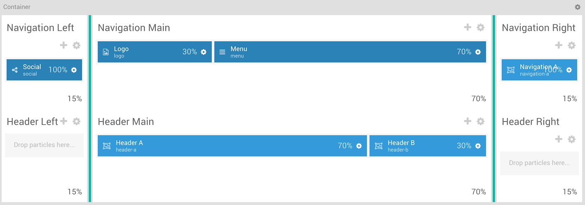

Here is a breakdown of the widget(s) and particle(s) that appear in these sections:

* [Container](#container)
    - [Navigation Left](#navigation-left)
        + [Social (Particle)](#social-(particle))
    - [Navigation Main](#navigation-main)
        + [Logo / Image (particle)](#logo-(particle))
        + [Social (Particle)](#social-(particle))
        + [Menu (Particle)](#menu-(particle))
    - [Navigation Right](#navigation-right)
        + [Navigation A (Widget Position)](#navigation-a-(widget-position))
            * [Search (Widget)](#search-(widget))
    - [Header Main](#header-main)
        + [Header A (Widget Position)](#header-a-(widget-position))
            * [WordPress Articles (Particle)](#wordpress-articles-(particle))
        + [Header B (Widget Position)](#header-b-(widget-position))
            * [Owl Carousel (Particle)](#owl-carousel-(particle))

## Container

| Option         | Setting          |
| :-----         | :-----           |
| Layout         | Remove Container |
| CSS Classes    | Blank            |
| Tag Attributes | Blank            |

The container wrapping both the **Navigation** and **Header** sections allowing the background set in the **Header** section to sit under both sections on the front page. You can set the two images featured in the background of this section in the **Style** tab of the Gantry administrator.

| Option             | Setting   |
| :-----             | :-----    |
| Background         | `#152248` |
| Background Image 1 | Custom    |
| Background Image 2 | Custom    |
| Text               | `#ffffff` |

## Navigation Left

The **Navigation Left** section hosts the **Social** particle on the front page. You will find the settings used in the section below.

### Section Settings

| Option         | Setting |
| :-----         | :-----  |
| CSS Classes    | Blank   |
| Tag Attributes | Blank   |

### Section Block Settings

| Option         | Setting         |
| :-----         | :-----          |
| CSS ID         | Blank           |
| CSS Classes    | `g-side-column` |
| Variations     | Equal Height    |
| Tag Attributes | Blank           |
| Fixed Size     | Checked         |
| Block Size     | `15%`           |

#### Social (Particle)

##### Particle Settings

| Option         | Setting |
| :-----         | :-----  |
| CSS Classes    | Blank   |
| Tag Attributes | Blank   |

##### Block Settings

| Option         | Setting         |
| :-----         | :-----          |
| CSS ID         | Blank           |
| CSS Classes    | `g-side-column` |
| Variations     | Equal Height    |
| Tag Attributes | Blank           |
| Fixed Size     | Checked         |
| Block Size     | `15%`           |

## Navigation Main

The **Navigation Main** section hosts the **Logo** and **Menu** particles on the front page. You will find the settings used in the section below.

### Section Settings

| Option         | Setting |
| :-----         | :-----  |
| CSS Classes    | Blank   |
| Tag Attributes | Blank   |

### Section Block Settings

| Option         | Setting           |
| :-----         | :-----            |
| CSS ID         | Blank             |
| CSS Classes    | `g-middle-column` |
| Variations     | Equal Height      |
| Tag Attributes | Blank             |
| Fixed Size     | Checked           |
| Block Size     | `70%`             |

#### Logo (Particle)

##### Particle Settings

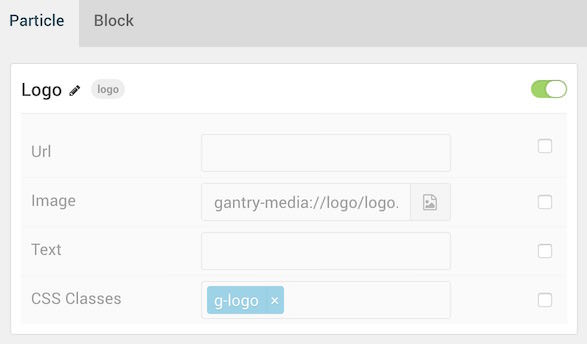

| Option      | Setting  |
| :-----      | :-----   |
| URL         | Blank    |
| Image       | Custom   |
| Text        | Blank    |
| CSS Classes | `g-logo` |

##### Block Settings

| Option         | Setting   |
| :-----         | :-----    |
| CSS ID         | Blank     |
| CSS Classes    | Blank     |
| Variations     | Blank     |
| Tag Attributes | Blank     |
| Fixed Size     | Unchecked |
| Block Size     | `30%`     |

#### Menu (Particle)

##### Particle Settings

| Option        | Setting          |
| :-----        | :-----           |
| Menu          | Use Default Menu |
| Base Item     | Active           |
| Start Level   | `1`              |
| End Level     | `0`              |
| Render Titles | Unchecked        |
| Mobile Target | Unchecked        |

##### Block Settings

| Option         | Setting     |
| :-----         | :-----      |
| CSS ID         | Blank       |
| CSS Classes    | Blank       |
| Variations     | Align Right |
| Tag Attributes | Blank       |
| Fixed Size     | Unchecked   |
| Block Size     | `70%`       |

## Navigation Right

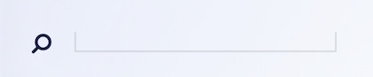

The **Navigation Right** section hosts the **Search** widget within the **Navigation A** widget position. You will find the settings used in the section below.

### Section Settings

| Option         | Setting |
| :-----         | :-----  |
| CSS Classes    | Blank   |
| Tag Attributes | Blank   |

### Section Block Settings

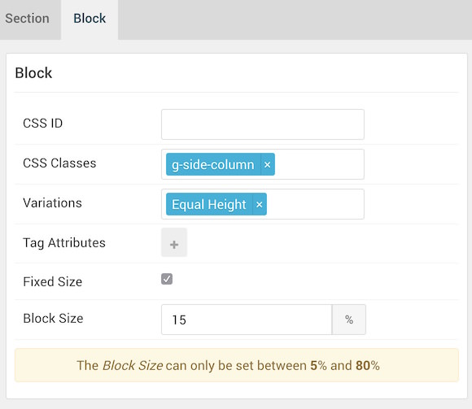

| Option         | Setting         |
| :-----         | :-----          |
| CSS ID         | Blank           |
| CSS Classes    | `g-side-column` |
| Variations     | Blank           |
| Tag Attributes | Blank           |
| Fixed Size     | Checked         |
| Block Size     | `15%`           |

#### Navigation A (Widget Position)

##### Particle Settings

| Option      | Setting        |
| :-----      | :-----         |
| Key         | `navigation-a` |
| Chrome      | `gantry`       |

##### Block Settings

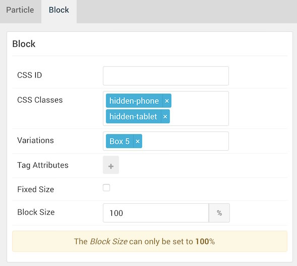

| Option         | Setting                        |
| :-----         | :-----                         |
| CSS ID         | Blank                          |
| CSS Classes    | `hidden-phone` `hidden-tablet` |
| Variations     | Box 5                          |
| Tag Attributes | Blank                          |
| Fixed Size     | Unchecked                      |
| Block Size     | `100%`                         |

##### Search (Widget)

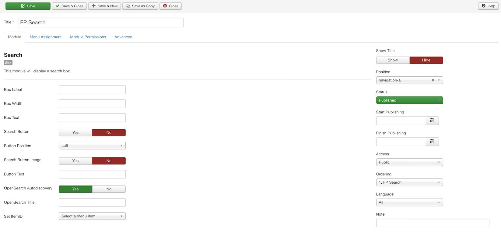

The **Search** widget is assigned to the **Navigation A** widget position. You will find its settings below.

| Option                   | Setting          |
| :-----                   | :-----           |
| Box Label                | Blank            |
| Box Width                | Blank            |
| Box Text                 | Blank            |
| Search Button            | No               |
| Button Position          | Left             |
| Search Button Image      | No               |
| Button Text              | Blank            |
| OpenSearch Autodiscovery | Yes              |
| OpenSearch Title         | Blank            |
| Set ItemID               | No Item Selected |
| Show Title               | Hide             |
| Position                 | `navigation-a`   |
| Status                   | Published        |

## Header Main

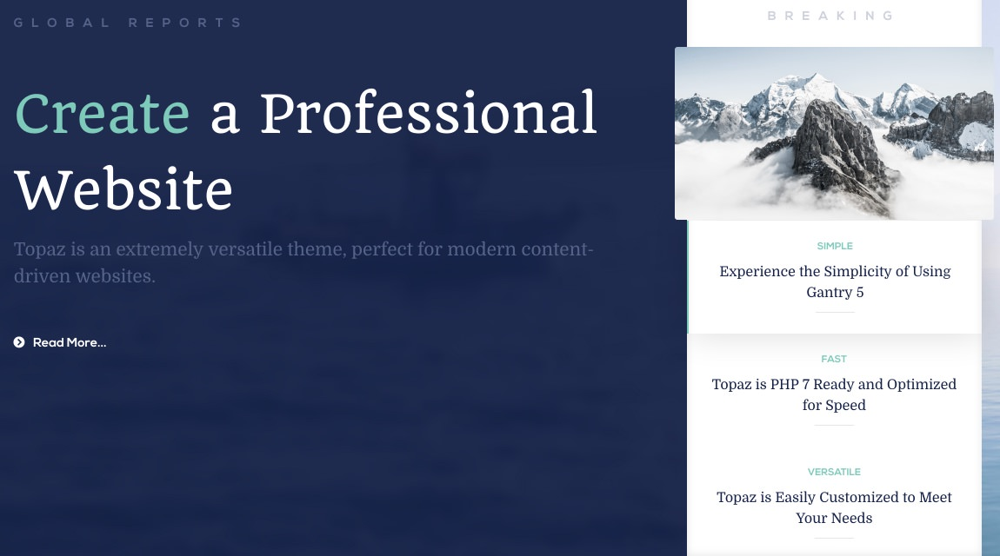

The **Header Main** section hosts a **WordPress Articles** particle, as well as an **Owl Carousel** particle, each within individual **Header A** and **Header B** widget positions. You will find the settings used in the section below.

The **Header Main** section sits between the **Header Left** and **Header Right** sections. Since these sections have nothing assigned to them in our demo, the **Header Main** section will appear on the front end to have 100% width on the front end.

### Section Settings

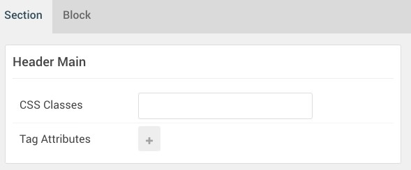

| Option         | Setting |
| :-----         | :-----  |
| CSS Classes    | Blank   |
| Tag Attributes | Blank   |

### Section Block Settings

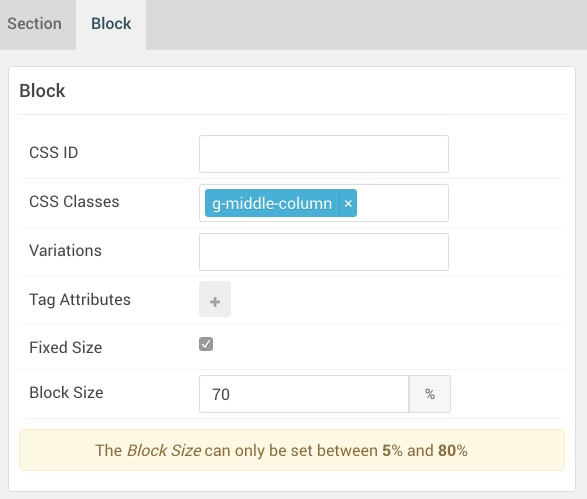

| Option         | Setting           |
| :-----         | :-----            |
| CSS ID         | Blank             |
| CSS Classes    | `g-middle-column` |
| Variations     | Blank             |
| Tag Attributes | Blank             |
| Fixed Size     | Checked           |
| Block Size     | `70%`             |

#### Header A (Widget Position)

##### Particle Settings

| Option | Setting    |
| :----- | :-----     |
| Key    | `header-a` |
| Chrome | `gantry`   |

##### Block Settings

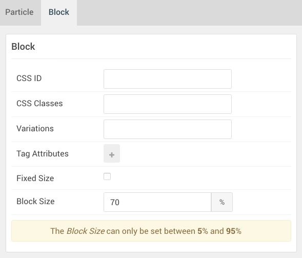

| Option         | Setting   |
| :-----         | :-----    |
| CSS ID         | Blank     |
| CSS Classes    | Blank     |
| Variations     | Blank     |
| Tag Attributes | Blank     |
| Fixed Size     | Unchecked |
| Block Size     | `70%`     |

##### WordPress Articles (Particle)

The **WordPress Articles** particle is assigned to the **Header A** widget position. This is done by creating a **Gantry 5 Particle** widget and assigning it to the **header-a** position, then selecting **WordPress Articles** as the **Particle** in the widget's settings. You will find its settings below.

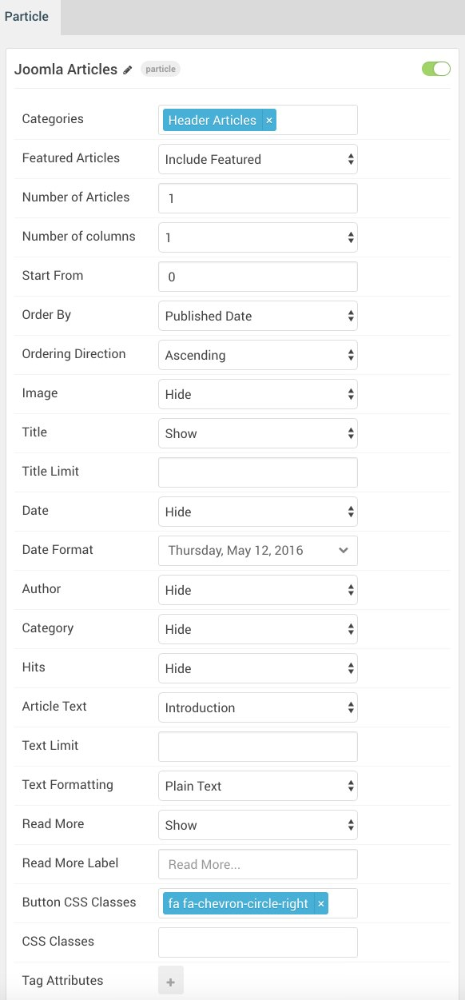

| Option             | Setting                      |
| :-----             | :-----                       |
| Categories         | `Header Articles`            |
| Featured Articles  | Include Featured             |
| Number of Articles | `1`                          |
| Number of Columns  | 1                            |
| Start From         | `0`                          |
| Order By           | Published Date               |
| Ordering Direction | Ascending                    |
| Image              | Hide                         |
| Title              | Show                         |
| Title Limit        | Blank                        |
| Date               | Hide                         |
| Date Format        | Weekday, Month Date, Year    |
| Author             | Hide                         |
| Category           | Hide                         |
| Hits               | Hide                         |
| Article Text       | Introduction                 |
| Text Limit         | Blank                        |
| Text Formatting    | Plain Text                   |
| Read More          | Show                         |
| Read More Label    | Blank                        |
| Button CSS Classes | `fa fa-chevron-circle-right` |
| CSS Classes        | Blank                        |
| Tag Attributes     | Blank                        |

#### Header B (Widget Position)

##### Particle Settings

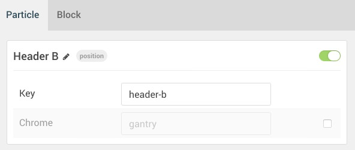

| Option      | Setting        |
| :-----      | :-----         |
| Key         | `header-b` |
| Chrome      | `gantry`       |

##### Block Settings

| Option         | Setting                         |
| :-----         | :-----                          |
| CSS ID         | Blank                           |
| CSS Classes    | `nomarginleft` `nomarginbottom` |
| Variations     | No Padding                      |
| Tag Attributes | Blank                           |
| Fixed Size     | Unchecked                       |
| Block Size     | `30%`                           |

##### Owl Carousel (Particle)

The **Owl Carousel** particle is assigned to the **Header B** widget position. This is done by creating a **Gantry 5 Particle** widget and assigning it to the **header-b** position, then selecting **Owl Carousel** as the **Particle** in the widget's settings. You will find its settings below.

| Option                             | Setting                                       |
| :-----                             | :-----                                        |
| CSS Classes                        | Blank                                         |
| Content Source                     | Particle                                      |
| Display at Once                    | `1`                                           |
| Title                              | `Breaking`                                    |
| Description                        | Blank                                         |
| Layout                             | Showcase                                      |
| Width                              | Full Width                                    |
| In Animation                       | fadeIn                                        |
| Out Animation                      | fadeOut                                       |
| Prev Next                          | Disable                                       |
| Prev Text                          | Blank                                         |
| Next Text                          | Blank                                         |
| Dots                               | Disable                                       |
| Loop                               | Enable                                        |
| Autoplay                           | Disable                                       |
| Autoplay Speed                     | `5000`                                        |
| Pause on Hover                     | Enable                                        |
| Owl Carousel Item 1 Name           | `Simple`                                      |
| Owl Carousel Item 1 Image          | Custom                                        |
| Owl Carousel Item 1 Icon           | Blank                                         |
| Owl Carousel Item 1 Title          | `Simple`                                      |
| Owl Carousel Item 1 Subtitle       | `Experience the Simplicity of Using Gantry 5` |
| Owl Carousel Item 1 Author         | Blank                                         |
| Owl Carousel Item 1 Author Image   | Blank                                         |
| Owl Carousel Item 1 Description    | Blank                                         |
| Owl Carousel Item 1 Link           | Blank                                         |
| Owl Carousel Item 1 Link Text      | Blank                                         |
| Owl Carousel Item 1 Target         | Self                                          |
| Owl Carousel Item 1 Button Classes | Blank                                         |

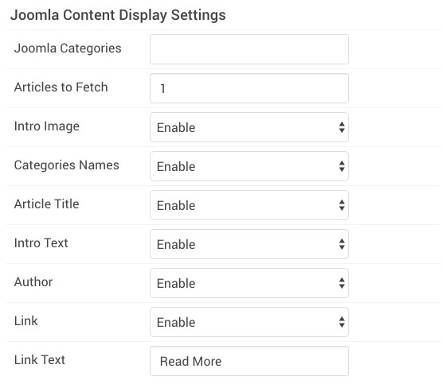

| Option            | Setting     |
| :-----            | :-----      |
| WordPress Categories | Blank       |
| Articles to Fetch | `1`         |
| Intro Image       | Enable      |
| Categories Names  | Enable      |
| Article Title     | Enable      |
| Intro Text        | Enable      |
| Author            | Enable      |
| Link              | Enable      |
| Link Text         | `Read More` |
