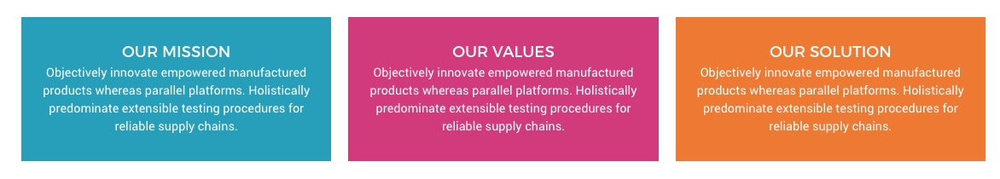
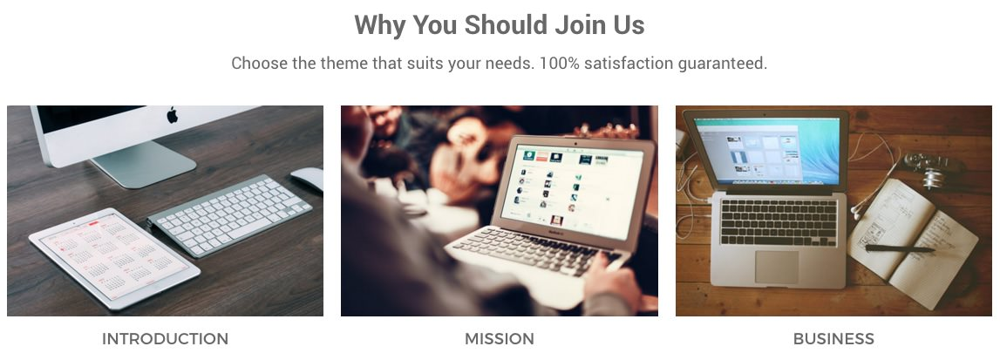
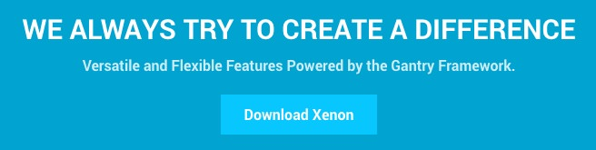

## Introduction

The **About Us** example page demonstrates how you can create a beautiful page with the Xenon theme. Here is some information to help you replicate this page as it appears in the demo.

## Widgets and Particles

Below is a brief rundown of the widgets and particles used to make up the demo page.

:   1. **Header - Info List (Particle)** [7%, 45%, se]
    2. **Above - Block Content (Particle)** [17%, 7%, se]
    3. **Mainbar - Block Content (Particle)** [32%, 7%, se]
    4. **Expanded - Block Content (Particle)** [57%, 7%, se]
    5. **Extension - Info List (Particle)** [70%, 30%, se]
    6. **Bottom - Text (Widget)** [87%, 8%, se]
    7. **Bottom - Newsletter (Particle)** [87%, 35%, se]
    8. **Bottom - To Top (Particle)** [87%, 65%, se]

1. [Header](#showcase-section)
2. [Above](#feature-section)
3. [Mainbar](#mainbar-section)
4. [Expanded](#expanded-section)
5. [Extension](#extension-section)
6. [Bottom](#bottom-section)

## Header Section

This area of the page is a **Info List** particle. You will find the settings used in our demo below.

### Particle Settings

| Field                 | Setting                              |
| :-----                | :-----                               |
| Particle Name         | `About Us - Header`                  |
| CSS Classes           | `center` `g-layercontent` `noborder` |
| Title                 | Blank                                |
| Intro                 | Blank                                |
| Grid Column           | 1 Column                             |
| Item 1 Name           | `About Us`                           |
| Item 1 Image          | Blank                                |
| Item 1 Image Location | Left                                 |
| Item 1 Text Style     | Header                               |
| Item 1 Image Style    | Compact                              |
| Item 1 Description    | `Who We Are`                         |
| Item 1 Tag            | Blank                                |
| Item 1 Sub Tag        | Blank                                |
| Item 1 Label          | Blank                                |
| Item 1 Link           | Blank                                |
| Item 1 Icon           | Blank                                |
| Read More Classes     | Blank                                |

### Block Settings

| Option         | Setting     |
| :----------    | :---------- |
| CSS ID         | Blank       |
| CSS Classes    | Blank       |
| Variations     | Blank       |
| Tag Attributes | Blank       |
| Fixed Size     | Unchecked   |
| Block Size     | `100%`      |

## Above Section

This area of the page is a **Block Content** particle. You will find the settings used in our demo below.

### Particle Settings

| Field                 | Setting                                                                                                                                                               |
| :-----                | :-----                                                                                                                                                                |
| Particle Name         | `About Us - Mission - Values - Solution`                                                                                                                              |
| CSS Classes           | Blank                                                                                                                                                                 |
| Title                 | Blank                                                                                                                                                                 |
| Image                 | Blank                                                                                                                                                                 |
| Headline              | Blank                                                                                                                                                                 |
| Description           | Blank                                                                                                                                                                 |
| Link                  | Blank                                                                                                                                                                 |
| Link Text             | Blank                                                                                                                                                                 |
| Item 1 Name           | `Our Mission`                                                                                                                                                         |
| Item 1 Title          | `Our Mission`                                                                                                                                                         |
| Item 1 Icon           | Blank                                                                                                                                                                 |
| Item 1 Image          | Blank                                                                                                                                                                 |
| Item 1 RokBox Image   | Blank                                                                                                                                                                 |
| Item 1 Caption        | Blank                                                                                                                                                                 |
| Item 1 Sub Title      | Blank                                                                                                                                                                 |
| Item 1 Description    | `Objectively innovate empowered manufactured products whereas parallel platforms. Holistically predominate extensible testing procedures for reliable supply chains.` |
| Item 1 CSS Classes    | `center` `box-blue`                                                                                                                                                   |
| Item 1 Button Label   | Blank                                                                                                                                                                 |
| Item 1 Button Link    | Blank                                                                                                                                                                 |
| Item 1 Button Classes | Blank                                                                                                                                                                 |

### Block Settings

| Option         | Setting     |
| :----------    | :---------- |
| CSS ID         | Blank       |
| CSS Classes    | Blank       |
| Variations     | Blank       |
| Tag Attributes | Blank       |
| Fixed Size     | Unchecked   |
| Block Size     | `100%`      |

## Mainbar Section

The **Mainbar** section includes a **Block Content** particle.

### Particle Settings

| Field                 | Setting                                                                 |
| :-----                | :-----                                                                  |
| Particle Name         | `About Us - Introduction - Mission - Business`                          |
| CSS Classes           | `center`                                                                |
| Title                 | Blank                                                                   |
| Image                 | Blank                                                                   |
| Headline              | `Why You Should Join Us`                                                |
| Description           | `Choose the theme that suits your needs. 100% satisfaction guaranteed.` |
| Link                  | Blank                                                                   |
| Link Text             | Blank                                                                   |
| Item 1 Name           | `Introduction`                                                          |
| Item 1 Title          | `Introduction`                                                          |
| Item 1 Icon           | Blank                                                                   |
| Item 1 Image          | Custom                                                                  |
| Item 1 RokBox Image   | Blank                                                                   |
| Item 1 Caption        | Blank                                                                   |
| Item 1 Sub Title      | Blank                                                                   |
| Item 1 Description    | Blank                                                                   |
| Item 1 CSS Classes    | `nopaddingall`                                                          |
| Item 1 Button Label   | Blank                                                                   |
| Item 1 Button Link    | Blank                                                                   |
| Item 1 Button Classes | Blank                                                                   |

### Block Settings

| Option         | Setting     |
| :----------    | :---------- |
| CSS ID         | Blank       |
| CSS Classes    | Blank       |
| Variations     | Blank       |
| Tag Attributes | Blank       |
| Fixed Size     | Unchecked   |
| Block Size     | `100%`      |

## Expanded Section

This area of the page is a **Block Content** particle. You will find the settings used in our demo below.

### Particle Settings

| Field                 | Setting                                                              |
| :-----                | :-----                                                               |
| Particle Name         | `About Us - Introduction - Mission - Business`                       |
| CSS Classes           | Blank                                                                |
| Title                 | Blank                                                                |
| Image                 | Blank                                                                |
| Headline              | Blank                                                                |
| Description           | Blank                                                                |
| Link                  | Blank                                                                |
| Link Text             | Blank                                                                |
| Item 1 Name           | `Our Mission`                                                        |
| Item 1 Title          | `Sophisticated`                                                      |
| Item 1 Icon           | `fa fa-dashboard fa-fw fa-2x`                                        |
| Item 1 Image          | Blank                                                                |
| Item 1 RokBox Image   | Blank                                                                |
| Item 1 Caption        | Blank                                                                |
| Item 1 Sub Title      | Blank                                                                |
| Item 1 Description    | `Dynamically procrastinate B2C users after installed base benefits.` |
| Item 1 CSS Classes    | `box-grey`                                                           |
| Item 1 Button Label   | Blank                                                                |
| Item 1 Button Link    | Blank                                                                |
| Item 1 Button Classes | Blank                                                                |

### Block Settings

| Option         | Setting     |
| :----------    | :---------- |
| CSS ID         | Blank       |
| CSS Classes    | Blank       |
| Variations     | Blank       |
| Tag Attributes | Blank       |
| Fixed Size     | Unchecked   |
| Block Size     | `100%`      |

## Extension Section

This area of the page is an **Info List** particle. You will find the settings used in our demo below.

### Particle Settings

| Field                 | Setting                                                            |
| :-----                | :-----                                                             |
| Particle Name         | `About Us - Header`                                                |
| CSS Classes           | `center` `g-layercontent` `noborder`                               |
| Title                 | Blank                                                              |
| Intro                 | Blank                                                              |
| Grid Column           | 1 Column                                                           |
| Item 1 Name           | `We Always Try to Create a Difference`                             |
| Item 1 Image          | Blank                                                              |
| Item 1 Image Location | Left                                                               |
| Item 1 Text Style     | Header                                                             |
| Item 1 Image Style    | Compact                                                            |
| Item 1 Description    | `Versatile and Flexible Features Powered by the Gantry Framework.` |
| Item 1 Tag            | Blank                                                              |
| Item 1 Sub Tag        | Blank                                                              |
| Item 1 Label          | `Download Xenon`                                                   |
| Item 1 Link           | `http://www.rockettheme.com/wordpress/themes/xenon`                |
| Item 1 Icon           | Blank                                                              |
| Read More Classes     | Blank                                                              |

### Block Settings

| Option         | Setting     |
| :----------    | :---------- |
| CSS ID         | Blank       |
| CSS Classes    | Blank       |
| Variations     | Blank       |
| Tag Attributes | Blank       |
| Fixed Size     | Unchecked   |
| Block Size     | `100%`      |

## Bottom Section

:   1. **Text (Widget)** [20%, 2%, se]
    2. **Newsletter (Particle)** [20%, 35%, se]
    3. **Text (Widget)** [20%, 67%, se]

This area of the page is made up of three particles.

### Text (Widget)

The **Text** widget here was placed in the **Bottom A** widget position. The widget position is created within the layout manager by using a **Widget Position** particle. The particle is assigned `bottom-a` as a key and `gantry` as its Chrome.

Below, you will find the widget settings we used in the demo:

### Widget Settings

| Field                        | Setting                                                                                                                              |
| :-----                       | :-----                                                                                                                               |
| Title                        | `About Xenon`                                                                                                                        |
| Content                      | `Xenon is available for purchase or part of a club membership from RocketTheme, inclusive of the RocketLauncher, theme and plugins.` |
| Automatically Add Paragraphs | Unchecked                                                                                                                            |
| Custom class(es)             | Blank                                                                                                                                |

### Newsletter (Particle)

The **Newsletter** particle here was placed in the **Bottom B** widget position. The widget position is created within the layout manager by using a **Widget Position** particle. The particle is assigned `bottom-b` as a key and `gantry` as its Chrome.

Below, you will find the particle settings we used in the demo:

### Particle Settings

| Field          | Setting                                                                                       |
| :-----         | :-----                                                                                        |
| Particle Name  | `Newsletter`                                                                                  |
| CSS Classes    | Blank                                                                                         |
| Heading Text   | `Subscribe to our newsletter and stay updated on the latest developments and special offers!` |
| InputBox Text  | `Email Address`                                                                               |
| Button Text    | `Join`                                                                                        |
| Feedburner URI | Custom                                                                                        |
| Button Classes | `button-4`                                                                                    |

### Text (Widget)

The **Text** widget here was placed in the **Bottom C** widget position. The widget position is created within the layout manager by using a **Widget Position** particle. The particle is assigned `bottom-c` as a key and `gantry` as its Chrome.

Below, you will find the widget settings we used in the demo:

### Widget Settings

| Field                        | Setting                                                                                                                              |
| :-----                       | :-----                                                                                                                               |
| Title                        | `Sample Sitemap`                                                                                                                        |
| Automatically Add Paragraphs | Unchecked                                                                                                                            |
| Custom class(es)             | Blank                                                                                                                                |

**Content**

~~~ .html

  

    <ul class="nomarginall noliststyle">
      <li><a href="http://demo.rockettheme.com/live/wordpress/xenon/">Home</a></li>
      <li><a href="http://demo.rockettheme.com/live/wordpress/xenon/overview/">Features</a></li>
      <li><a href="http://demo.rockettheme.com/live/wordpress/xenon/typography/">TypographyContent</a></li>
      <li><a href="http://demo.rockettheme.com/live/wordpress/xenon/particles/">Particles</a></li>
      <li><a href="http://demo.rockettheme.com/live/wordpress/xenon/block-variations/">Variations</a></li>
    </ul>
  

  

    <ul class="nomarginall noliststyle">
      <li><a href="http://demo.rockettheme.com/live/wordpress/xenon/typography/">Buttons</a></li>
      <li><a href="http://demo.rockettheme.com/live/wordpress/xenon/overview/">Pages</a></li>
      <li><a href="http://www.rockettheme.com/docs/wordpress/themes/xenon">Guide</a></li>
      <li><a href="http://www.rockettheme.com/forum/wordpress-theme-xenon">Support</a></li>
      <li><a href="http://www.rockettheme.com/wordpress/themes/xenon">Download</a></li>
    </ul>
  

~~~