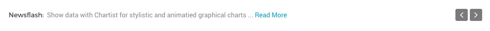
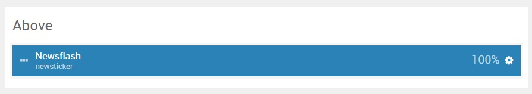
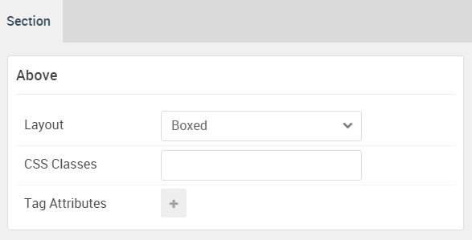

## Introduction

The **Above** section includes a single **News Ticker** particle.

Here is a breakdown of the widget(s) and particle(s) that appear in this section:

* [News Ticker (particle)](#news-ticker-(particle))

## Section Settings

| Option           | Setting     |
| :--------------- | :---------- |
| Layout           | Boxed       |
| CSS Classes      | Blank       |
| Tag Attributes   | Blank       |

## News Ticker (Particle)

#### Particle Settings

| Option                 | Setting                                                              |
| :-----                 | :-----                                                               |
| Particle Name          | `Newsflash`                                                          |
| CSS Classes            | Blank                                                                |
| Title                  | Blank                                                                |
| Label                  | `Newsflash:`                                                         |
| Item 1 Name            | `Introducing the News Ticker particle, perfect for content snippets` |
| Item 1 Content         | `Introducing the News Ticker particle, perfect for content snippets` |
| Item 1 Read More Label | `Read More`                                                          |
| Item 1 Read More Link  | `#`                                                                  |
| Item 1 Target          | Self                                                                 |

#### Block Settings

| Option         | Setting   |
| :-----         | :-----    |
| CSS ID         | Blank     |
| CSS Classes    | Blank     |
| Variations     | Blank     |
| Tag Attributes | Blank     |
| Fixed Size     | Unchecked |
| Block Size     | `100%`    |