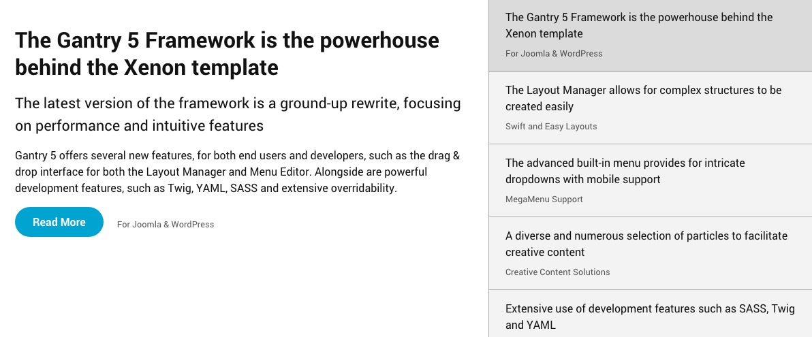
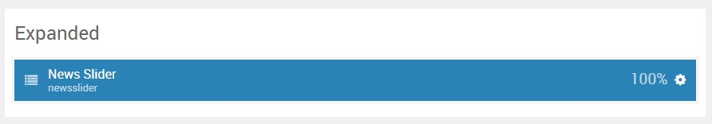
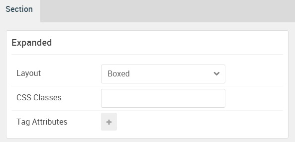

## Introduction

The **Expanded** section includes a single **News Slider** particle.

Here is a breakdown of the widget(s) and particle(s) that appear in this section:

* [News Slider (particle)](#news-slider-(particle))

## Section Settings

| Option           | Setting     |
| :--------------- | :---------- |
| Layout           | Boxed       |
| CSS Classes      | Blank       |
| Tag Attributes   | Blank       |

## News Slider (Particle)

#### Particle Settings

| Option                    | Setting                                                                                                                                                                                                                                                       |
| :-----                    | :-----                                                                                                                                                                                                                                                        |
| Particle Name             | `News Slider`                                                                                                                                                                                                                                        |
| CSS Classes               | Blank                                                                                                                                                                                                                                                         |
| Title                     | Blank                                                                                                                                                                                                                                                         |
| Height                    | `500px`                                                                                                                                                                                                                                                       |
| Item 1 Name               | `The Gantry 5 Framework is the powerhouse behind the Xenon theme`                                                                                                                                                                                          |
| Item 1 Subtitle           | `For Joomla & WordPress`                                                                                                                                                                                                                                      |
| Item 1 Header Description | `The latest version of the framework is a ground-up rewrite, focusing on performance and intuitive features`                                                                                                                                                  |
| Item 1 Description        | `Gantry 5 offers several new features, for both end users and developers, such as the drag & drop interface for both the Layout Manager and Menu Editor. Alongside are powerful development features, such as Twig, YAML, SASS and extensive overridability.` |
| Item 1 Button Label       | `Read More`                                                                                                                                                                                                                                                   |
| Item 1 Button Link        | `#`                                                                                                                                                                                                                                                           |
| Item 1 Target             | Self                                                                                                                                                                                                                                                          |
| Item 1 Button Classes     | `button-2`                                                                                                                                                                                                                                                    |

#### Block Settings

| Option         | Setting        |
| :-----         | :-----         |
| CSS ID         | Blank          |
| CSS Classes    | `fp-expanded-a` |
| Variations     | Blank          |
| Tag Attributes | Blank          |
| Fixed Size     | Unchecked      |
| Block Size     | `100%`         |

