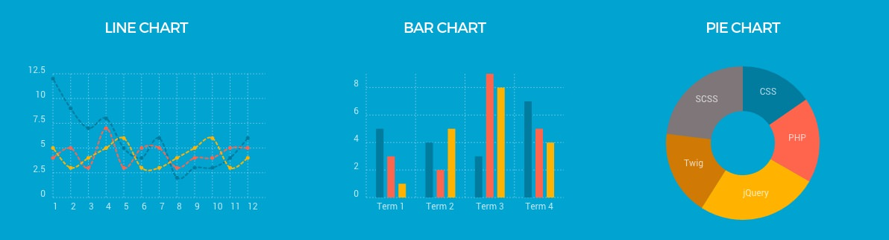

## Introduction

The **Extension** section includes three **Chartist** particles.

Here is a breakdown of the widget(s) and particle(s) that appear in this section:

* [Chartist (particle)](#chartist-(particle)-1)
* [Chartist (particle)](#chartist-(particle)-2)
* [Chartist (particle)](#chartist-(particle)-3)

## Section Settings

| Option           | Setting     |
| :--------------- | :---------- |
| Layout           | Boxed       |
| CSS Classes      | Blank       |
| Tag Attributes   | Blank       |

## Chartist (Particle) 1

### Particle Settings

| Option        | Setting                                                         |
| :-----        | :-----                                                          |
| Particle Name | `Line Chart`                                                      |
| CSS Classes   | `title-center`                                                  |
| Title         | `Line Chart`                                                    |
| Chart Type    | `Line`                                                          |
| Labels Data   | `'1', '2', '3', '4', '5', '6', '7', '8', '9', '10', '11', '12'` |

**Series Data**

~~~ .txt
[12, 9, 7, 8, 5, 4, 6, 2, 3, 3, 4, 6],
[4,  5, 3, 7, 3, 5, 5, 3, 4, 4, 5, 5],
[5,  3, 4, 5, 6, 3, 3, 4, 5, 6, 3, 4]
~~~

### Block Settings

| Option         | Setting          |
| :-----         | :-----           |
| CSS ID         | Blank            |
| CSS Classes    | `fp-extension-a` |
| Variations     | Blank            |
| Tag Attributes | Blank            |
| Fixed Size     | Unchecked        |
| Block Size     | `33.3%`          |

## Chartist (Particle) 2

### Particle Settings

| Option        | Setting                                  |
| :-----        | :-----                                   |
| Particle Name | `Bar Chart`                               |
| CSS Classes   | `title-center`                           |
| Title         | `Bar Chart`                              |
| Chart Type    | `Bar`                                    |
| Labels Data   | `'Term 1', 'Term 2', 'Term 3', 'Term 4'` |

**Series Data**

~~~ .txt
[5, 4, 3, 7],
[3, 2, 9, 5],
[1, 5, 8, 4]
~~~

### Block Settings

| Option         | Setting          |
| :-----         | :-----           |
| CSS ID         | Blank            |
| CSS Classes    | `fp-extension-b` |
| Variations     | Blank            |
| Tag Attributes | Blank            |
| Fixed Size     | Unchecked        |
| Block Size     | `33.3%`          |

## Chartist (Particle) 3

### Particle Settings

| Option        | Setting                                    |
| :-----        | :-----                                     |
| Particle Name | `Pie Chart`                                 |
| CSS Classes   | `title-center`                             |
| Title         | `Pie Chart`                                |
| Chart Type    | `Pie`                                      |
| Labels Data   | `'30',' 35', '50', '35', '45'`             |
| Series Data   | `['CSS', 'PHP', 'jQuery', 'Twig', 'SCSS']` |

### Block Settings

| Option         | Setting          |
| :-----         | :-----           |
| CSS ID         | Blank            |
| CSS Classes    | `fp-extension-c` |
| Variations     | Blank            |
| Tag Attributes | Blank            |
| Fixed Size     | Unchecked        |
| Block Size     | `33.3%`          |