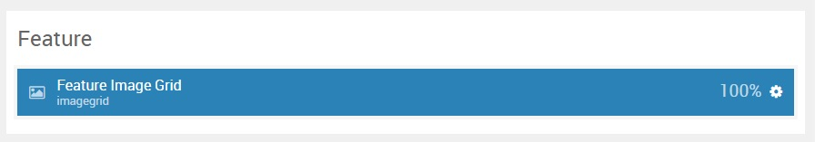
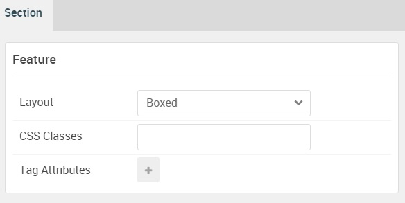

## Introduction

The **Feature** section includes a single **Image Grid** particle.

Here is a breakdown of the widget(s) and particle(s) that appear in this section:

* [Image Grid (particle)](#image-grid-(particle))

## Section Settings

| Option           | Setting     |
| :--------------- | :---------- |
| Layout           | Boxed       |
| CSS Classes      | Blank       |
| Tag Attributes   | Blank       |

## Image Grid (Particle)

### Particle Settings

| Option             | Setting                                         |
| :-----             | :-----                                          |
| Particle Name      | `Feature Image Grid`                            |
| CSS Classes        | Blank                                           |
| Title              | Blank                                           |
| Description        | Blank                                           |
| Grid Column        | 5 Columns                                       |
| Album Name         | `RokBox Image Grid`                             |
| Item 1 Name        | `Item 01`                                       |
| Item 1 Promo Image | Custom                                          |
| Item 1 Caption     | `Multiple columns available for menu dropdowns` |

### Block Settings

| Option         | Setting        |
| :-----         | :-----         |
| CSS ID         | Blank          |
| CSS Classes    | `fp-feature-a` |
| Variations     | Blank          |
| Tag Attributes | Blank          |
| Fixed Size     | Unchecked      |
| Block Size     | `100%`         |

