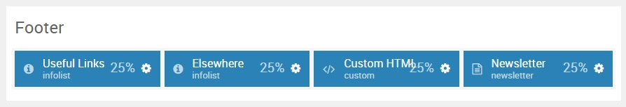
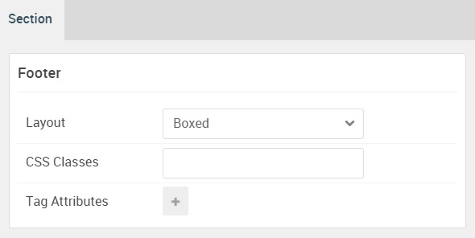

## Introduction

:	1. **Info List (Particle)** [5%, 1%, se]
	2. **Info List (Particle)** [5%, 25%, se]
	3. **Custom HTML (Particle)** [5%, 50%, se]
	4. **Newsletter (Particle)** [5%, 75%, se]

The **Footer** section includes four particles.

Here is a breakdown of the widget(s) and particle(s) that appear in this section:

* [Info List (particle)](#info-list-(particle)-1)
* [Info List (particle)](#info-list-(particle)-2)
* [Custom HTML (particle)](#custom-html-(particle))
* [Newsletter (particle)](#newsletter-(particle))

## Section Settings

| Option           | Setting     |
| :--------------- | :---------- |
| Layout           | Boxed       |
| CSS Classes      | Blank       |
| Tag Attributes   | Blank       |

## Info List (Particle) 1

### Particle Settings

| Option                   | Setting        |
| :-----                   | :-----         |
| Particle Name            | `Useful Links` |
| CSS Classes              | Blank          |
| Title                    | `Useful Links` |
| Intro                    | Blank          |
| Grid Column              | 2 Columns      |
| Item 1 Name              | `About`        |
| Item 1 Image             | Blank          |
| Item 1 Image Location    | Left           |
| Item 1 Text Style        | Compact        |
| Item 1 Image Style       | Compact        |
| Item 1 Description       | Blank          |
| Item 1 Tag               | Blank          |
| Item 1 Sub Tag           | Blank          |
| Item 1 Label             | Blank          |
| Item 1 Link              | `#`            |
| Item 1 Icon              | Blank          |
| Item 1 Read More Classes | Blank          |

### Block Settings

| Option         | Setting       |
| :-----         | :-----        |
| CSS ID         | Blank         |
| CSS Classes    | `fp-footer-a` |
| Variations     | Blank         |
| Tag Attributes | Blank         |
| Fixed Size     | Unchecked     |
| Block Size     | `25%`         |

## Info List (Particle) 2

### Particle Settings

| Option                   | Setting                               |
| :-----                   | :-----                                |
| Particle Name            | `Elsewhere`                           |
| CSS Classes              | Blank                                 |
| Title                    | `Elsewhere`                           |
| Intro                    | Blank                                 |
| Grid Column              | 2 Columns                             |
| Item 1 Name              | `Facebook`                            |
| Item 1 Image             | Blank                                 |
| Item 1 Image Location    | Left                                  |
| Item 1 Text Style        | Compact                               |
| Item 1 Image Style       | Compact                               |
| Item 1 Description       | Blank                                 |
| Item 1 Tag               | Blank                                 |
| Item 1 Sub Tag           | Blank                                 |
| Item 1 Label             | Blank                                 |
| Item 1 Link              | `http://www.facebook.com/RocketTheme` |
| Item 1 Icon              | Blank                                 |
| Item 1 Read More Classes | Blank                                 |

### Block Settings

| Option         | Setting       |
| :-----         | :-----        |
| CSS ID         | Blank         |
| CSS Classes    | `fp-footer-b` |
| Variations     | Blank         |
| Tag Attributes | Blank         |
| Fixed Size     | Unchecked     |
| Block Size     | `25%`         |

## Custom HTML (Particle)

### Particle Settings

| Option             | Setting       |
| :-----             | :-----        |
| Particle Name      | `Custom HTML` |
| Process Shortcodes | Unchecked     |

**Custom HTML**

~~~ .html

    <h3 class="g-title">About</h3>
    
All demo content is for sample purposes only, to represent a live site.

    
Note: Xenon is built on the latest version of the Gantry 5 Framework.
     

~~~

### Block Settings

| Option         | Setting       |
| :-----         | :-----        |
| CSS ID         | Blank         |
| CSS Classes    | `fp-footer-c` |
| Variations     | Blank         |
| Tag Attributes | Blank         |
| Fixed Size     | Unchecked     |
| Block Size     | `25%`         |

## Newsletter (Particle)

### Particle Settings

| Option         | Setting                       |
| :-----         | :-----                        |
| Particle Name  | `Newsletter`                  |
| CSS Classes    | Blank                         |
| Title          | `Newsletter`                  |
| Heading Text   | `Subscribe to our newsletter` |
| InputBox Text  | `Email`                       |
| Button Text    | `Done!`                       |
| Feedburner URI | Blank                         |
| Button Classes | `button-2`                    |

### Block Settings

| Option         | Setting       |
| :-----         | :-----        |
| CSS ID         | Blank         |
| CSS Classes    | `fp-footer-d` |
| Variations     | Blank         |
| Tag Attributes | Blank         |
| Fixed Size     | Unchecked     |
| Block Size     | `25%`         |

