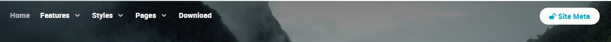
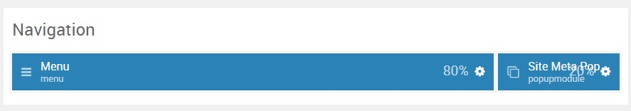

## Introduction

:   1. **Menu (Particle)** [10%, 2%, se]
    2. **Popup Widget (Particle)** [10%, 88%, se]

The **Navigation** section includes two particles, **Menu** and **Popup Widget**. The **Popup Widget** particle puts the **Meta** widget in a popup.

Here is a breakdown of the widget(s) and particle(s) that appear in this section:

* [Menu (particle)](#menu-(particle))
* [Popup Widget (Particle)](#popup-widget-(particle))

## Section Settings

| Option           | Setting     |
| :--------------- | :---------- |
| Layout           | Boxed       |
| CSS Classes      | Blank       |
| Tag Attributes   | Blank       |

## Menu (Particle)

### Particle Settings

| Option        | Setting   |
| :-----        | :-----    |
| Particle Name | `Menu`    |
| Menu          | Main-menu |
| Base Item     | Blank     |
| Start Level   | `1`       |
| Max Levels    | `0`       |
| Render Titles | Unchecked |
| Mobile Target | Unchecked |

### Block Settings

| Option         | Setting   |
| :-----         | :-----    |
| CSS ID         | Blank     |
| CSS Classes    | Blank     |
| Variations     | Blank     |
| Tag Attributes | Blank     |
| Fixed Size     | Unchecked |
| Block Size     | `80%`     |

## Popup Widget (Particle)

### Particle Settings

| Option            | Setting        |
| :-----            | :-----         |
| Particle Name     | `Popup Widget` |
| CSS Classes       | Blank          |
| Title             | Blank          |
| Widget            | `Meta`         |
| Guest Button Icon | `fa fa-unlock` |
| Guest Text        | `Site Meta`    |
| User Button Icon | `fa fa-lock`   |
| User Text         | `Site Meta`    |
| Button Classes    | `button-2`     |

### Block Settings

| Option         | Setting   |
| :-----         | :-----    |
| CSS ID         | Blank     |
| CSS Classes    | Blank     |
| Variations     | Blank     |
| Tag Attributes | Blank     |
| Fixed Size     | Unchecked |
| Block Size     | `20%`     |
