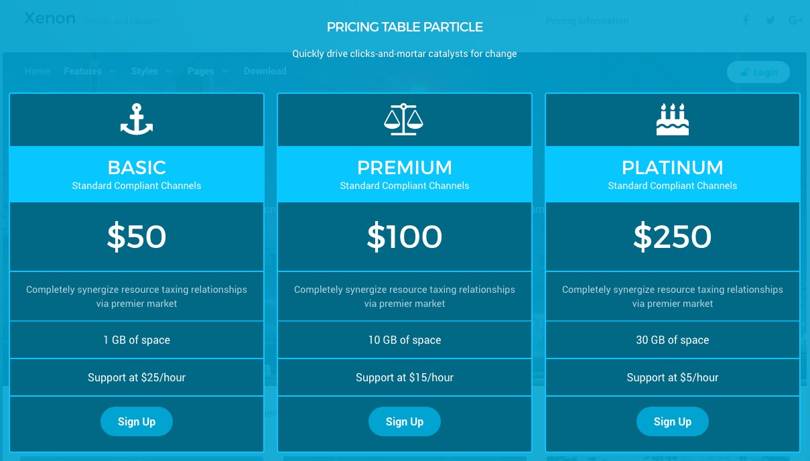

## Introduction

:	1. **Promo Content (Particle)** [5%, 35%, se]
	2. **Pricing Table (Particle)** [25%, 5%, se]
	3. **Pricing Table (Particle)** [25%, 40%, se]
	4. **Pricing Table (Particle)** [25%, 70%, se]

The **Overlay** section includes four particles assigned to the **overlay-a**, **overlay-b**, **overlay-c**, and **overlay-top** module positions.

Here is a breakdown of the widget(s) and particle(s) that appear in this section:

* [Promo Content (particle)](#promo-content-(particle))
* [Pricing Table (particle)](#info-list-(particle)-1)
* [Pricing Table (particle)](#custom-html-(particle)-2)
* [Pricing Table (particle)](#newsletter-(particle)-3)

## Section Settings

| Option           | Setting                   |
| :--------------- | :----------               |
| Layout           | Fullwidth (Boxed Content) |
| CSS Classes      | Blank                     |
| Tag Attributes   | Blank                     |

## Promo Content (Particle)

### Particle Settings

| Option           | Setting                                                |
| :-----           | :-----                                                 |
| Particle Name    | `Pricing Table Particle`                               |
| CSS Classes      | Blank                                                  |
| Title            | `Pricing Table Particle`                               |
| Promo Style      | Standard                                               |
| Promo Text       | Blank                                                  |
| Description      | `Quickly drive clicks-and-mortar catalysts for change` |
| Readmore Text    | Blank                                                  |
| Readmore Classes | Blank                                                  |
| Link             | Blank                                                  |
| Readmore Style   | Block                                                  |
| Tags             | Blank                                                  |

### Block Settings

| Option         | Setting          |
| :-----         | :-----           |
| CSS ID         | Blank            |
| CSS Classes    | `fp-overlay-top` |
| Variations     | Blank            |
| Tag Attributes | Blank            |
| Fixed Size     | Unchecked        |
| Block Size     | `100%`           |

## Pricing Table (Particle) 1

### Particle Settings

| Option          | Setting                                                                 |
| :-----          | :-----                                                                  |
| Particle Name   | `Basic`                                                                 |
| CSS Classes     | Blank                                                                   |
| Title           | Blank                                                                   |
| Icon            | `fa fa-anchor fa-fw fa-3x`                                              |
| Column Title    | `Basic`                                                                 |
| Column Subtitle | `Standard Compliant Channels`                                           |
| Price           | `$50`                                                                   |
| Description     | `Completely synergize resource taxing relationships via premier market` |
| Button Label    | `Sign Up`                                                               |
| Button Link     | `#`                                                                     |
| Target          | Self                                                                    |
| Button Classes  | `button-2`                                                              |
| Item 1 Name     | `1 GB of Space`                                                         |
| Item 1 Text     | `1 GB of space`                                                         |

### Block Settings

| Option         | Setting   |
| :-----         | :-----    |
| CSS ID         | Blank     |
| CSS Classes    | Blank     |
| Variations     | Blank     |
| Tag Attributes | Blank     |
| Fixed Size     | Unchecked |
| Block Size     | `33.3%`   |

## Pricing Table (Particle) 2

### Particle Settings

| Option          | Setting                                                                 |
| :-----          | :-----                                                                  |
| Particle Name   | `Premium`                                                               |
| CSS Classes     | Blank                                                                   |
| Title           | Blank                                                                   |
| Icon            | `fa fa-balance-scale fa-fw fa-3x`                                       |
| Column Title    | `Premium`                                                               |
| Column Subtitle | `Standard Compliant Channels`                                           |
| Price           | `$100`                                                                  |
| Description     | `Completely synergize resource taxing relationships via premier market` |
| Button Label    | `Sign Up`                                                               |
| Button Link     | `#`                                                                     |
| Target          | Self                                                                    |
| Button Classes  | `button-2`                                                              |
| Item 1 Name     | `10 GB of Space`                                                        |
| Item 1 Text     | `10 GB of space`                                                        |

### Block Settings

| Option         | Setting   |
| :-----         | :-----    |
| CSS ID         | Blank     |
| CSS Classes    | Blank     |
| Variations     | Blank     |
| Tag Attributes | Blank     |
| Fixed Size     | Unchecked |
| Block Size     | `33.3%`   |

## Pricing Table (Particle) 3

### Particle Settings

| Option          | Setting                                                                 |
| :-----          | :-----                                                                  |
| Particle Name   | `Platinum`                                                              |
| CSS Classes     | Blank                                                                   |
| Title           | Blank                                                                   |
| Icon            | `fa fa-anchor fa-fw fa-3x`                                              |
| Column Title    | `Platinum`                                                              |
| Column Subtitle | `Standard Compliant Channels`                                           |
| Price           | `$250`                                                                  |
| Description     | `Completely synergize resource taxing relationships via premier market` |
| Button Label    | `Sign Up`                                                               |
| Button Link     | `#`                                                                     |
| Target          | Self                                                                    |
| Button Classes  | `button-2`                                                              |
| Item 1 Name     | `30 GB of Space`                                                        |
| Item 1 Text     | `30 GB of space`                                                        |

### Block Settings

| Option         | Setting   |
| :-----         | :-----    |
| CSS ID         | Blank     |
| CSS Classes    | Blank     |
| Variations     | Blank     |
| Tag Attributes | Blank     |
| Fixed Size     | Unchecked |
| Block Size     | `33.3%`   |