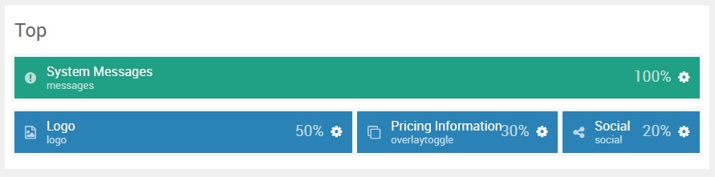
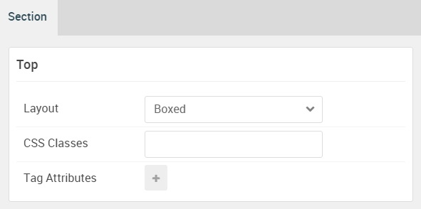

## Introduction

:   1. **Logo (Particle)** [10%, 2%, se]
    2. **Overlay Toggle (Particle)** [10%, 65%, se]
    3. **Social (Particle)** [10%, 90%, se]

The **Top** section includes three particles, **Logo**, **Overlay Toggle**, and **Social**.

Here is a breakdown of the widget(s) and particle(s) that appear in this section:

* [Logo (particle)](#logo-(particle))
* [Overlay Toggle (Particle)](#overlay-toggle-(particle))
* [Social (Particle)](#social-(particle))

## Section Settings

| Option           | Setting     |
| :--------------- | :---------- |
| Layout           | Boxed       |
| CSS Classes      | Blank       |
| Tag Attributes   | Blank       |

## Logo (Particle)

### Particle Settings

| Option        | Setting                |
| :-----        | :-----                 |
| Particle Name | `Logo`                 |
| URL           | Blank                  |
| Image         | Blank                  |
| Text          | `Xenon`                |
| Tagline       | `Vibrant and Elegant.` |
| CSS Classes   | `g-logo`               |

### Block Settings

| Option         | Setting   |
| :-----         | :-----    |
| CSS ID         | Blank     |
| CSS Classes    | Blank     |
| Variations     | Blank     |
| Tag Attributes | Blank     |
| Fixed Size     | Unchecked |
| Block Size     | `50%`     |

## Overlay Toggle (Particle)

### Particle Settings

| Option        | Setting               |
| :-----        | :-----                |
| Particle Name | `Pricing Information` |
| CSS Classes   | Blank                 |
| Title         | Blank                 |
| Menu Text     | `Pricing Information` |

### Block Settings

| Option         | Setting    |
| :-----         | :-----     |
| CSS ID         | Blank      |
| CSS Classes    | `fp-top-a` |
| Variations     | Blank      |
| Tag Attributes | Blank      |
| Fixed Size     | Unchecked  |
| Block Size     | `30%`      |

## Social (Particle)

### Particle Settings

| Option             | Setting                               |
| :-----             | :-----                                |
| Particle Name      | `Social`                              |
| CSS Classes        | `social`                              |
| Title              | Blank                                 |
| Target             | Self                                  |
| Social Item 1 Name | `Facebook`                            |
| Social Item 1 Icon | `fa fa-facebook fa-fw`                |
| Social Item 1 Text | Blank                                 |
| Social Item 1 Link | `http://www.facebook.com/RocketTheme` |

### Block Settings

| Option         | Setting    |
| :-----         | :-----     |
| CSS ID         | Blank      |
| CSS Classes    | `fp-top-b` |
| Variations     | Blank      |
| Tag Attributes | Blank      |
| Fixed Size     | Unchecked  |
| Block Size     | `20%`      |

