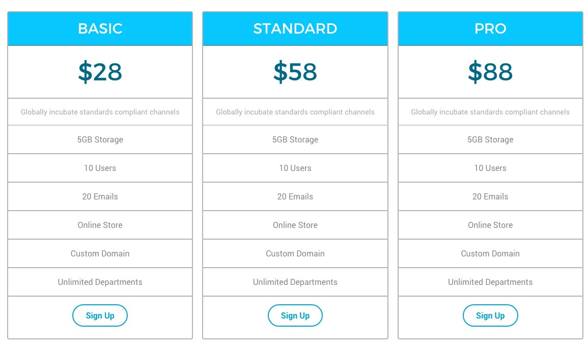
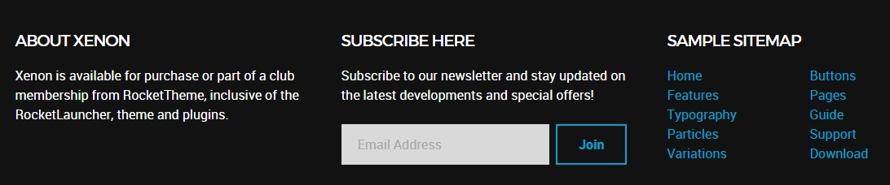

## Introduction

The **Pricing** example page demonstrates how you can create a beautiful page with the Xenon theme. Here is some information to help you replicate this page as it appears in the demo.

## Particles and Particles

Below is a brief rundown of the widgets and particles used to make up the demo page.

:   1. **Header - Info List (Particle)** [6%, 40%, se]
    2. **Above - Custom HTML (Particle)** [12%, 7% se]
    3. **Mainbar - Page Content** [43%, 7%, se]
    4. **Expanded - Image Grid (Particle)** [52%, 7%, se]
    5. **Extension - Info List (Particle)** [78%, 40%, se]
    6. **Bottom - Text (Widget)** [87%, 8%, se]
    7. **Bottom - Newsletter (Particle)** [87%, 35%, se]
    8. **Bottom - To Top (Particle)** [87%, 65%, se]

1. [Header](#header-section)
2. [Above](#feature-section)
3. [Mainbar](#mainbar-section)
4. [Expanded](#expanded-section)
5. [Extension](#extension-section)
6. [Bottom](#bottom-section)

## Header Section

This area of the page is a **Info List** particle. You will find the settings used in our demo below.

### Particle Settings

| Field                 | Setting                                 |
| :-----                | :-----                                  |
| Particle Name         | `Pricing - Header`                     |
| CSS Classes           | `center` `g-layercontent` `noborder`    |
| Title                 | Blank                                   |
| Intro                 | Blank                                   |
| Grid Column           | 1 Column                                |
| Item 1 Name           | `Awesome Plans`                         |
| Item 1 Image          | Blank                                   |
| Item 1 Image Location | Left                                    |
| Item 1 Text Style     | Header                                  |
| Item 1 Image Style    | Compact                                 |
| Item 1 Description    | `Choose the Plan That Suits Your Needs` |
| Item 1 Tag            | Blank                                   |
| Item 1 Sub Tag        | Blank                                   |
| Item 1 Label          | Blank                                   |
| Item 1 Link           | Blank                                   |
| Item 1 Icon           | Blank                                   |
| Read More Classes     | Blank                                   |

### Block Settings

| Option         | Setting     |
| :----------    | :---------- |
| CSS ID         | Blank       |
| CSS Classes    | Blank       |
| Variations     | Blank       |
| Tag Attributes | Blank       |
| Fixed Size     | Unchecked   |
| Block Size     | `100%`      |

## Above Section

This area of the page is a **Custom HTML** particle. You will find the settings used in our demo below.

### Custom HTML (Particle)

### Particle Settings

| Field              | Setting       |
| :-----             | :-----        |
| Particle Name      | `Custom HTML` |
| Process Shortcodes | Unchecked     |

### Custom HTML

~~~ .html

  

    

      <ul class="g-pricingtable">
        <li class="g-pricingtable-title">Basic
        </li>
        <li class="g-pricingtable-price">$28
        </li>
        <li class="g-pricingtable-desc">Globally incubate standards compliant channels
        </li>
        <li class="g-pricingtable-item">5GB Storage
        </li>
        <li class="g-pricingtable-item">10 Users
        </li>
        <li class="g-pricingtable-item">20 Emails
        </li>
        <li class="g-pricingtable-item">Online Store
        </li>
        <li class="g-pricingtable-item">Custom Domain
        </li>
        <li class="g-pricingtable-item">Unlimited Departments
        </li>
        <li class="g-pricingtable-cta">
          <a class="button button-3" href="http://www.rockettheme.com/joomla/templates/xenon">Sign Up</a>
        </li>
      </ul>
    

  

  

    

      <ul class="g-pricingtable">
        <li class="g-pricingtable-title">Standard
        </li>
        <li class="g-pricingtable-price">$58
        </li>
        <li class="g-pricingtable-desc">Globally incubate standards compliant channels
        </li>
        <li class="g-pricingtable-item">5GB Storage
        </li>
        <li class="g-pricingtable-item">10 Users
        </li>
        <li class="g-pricingtable-item">20 Emails
        </li>
        <li class="g-pricingtable-item">Online Store
        </li>
        <li class="g-pricingtable-item">Custom Domain
        </li>
        <li class="g-pricingtable-item">Unlimited Departments
        </li>
        <li class="g-pricingtable-cta">
          <a class="button button-3" href="http://www.rockettheme.com/joomla/templates/xenon">Sign Up</a>
        </li>
      </ul>
    

  

  

    

      <ul class="g-pricingtable">
        <li class="g-pricingtable-title">Pro
        </li>
        <li class="g-pricingtable-price">$88
        </li>
        <li class="g-pricingtable-desc">Globally incubate standards compliant channels
        </li>
        <li class="g-pricingtable-item">5GB Storage
        </li>
        <li class="g-pricingtable-item">10 Users
        </li>
        <li class="g-pricingtable-item">20 Emails
        </li>
        <li class="g-pricingtable-item">Online Store
        </li>
        <li class="g-pricingtable-item">Custom Domain
        </li>
        <li class="g-pricingtable-item">Unlimited Departments
        </li>
        <li class="g-pricingtable-cta">
          <a class="button button-3" href="http://www.rockettheme.com/joomla/templates/xenon">Sign Up</a>
        </li>
      </ul>
    

  

~~~

### Block Settings

| Option         | Setting     |
| :----------    | :---------- |
| CSS ID         | Blank       |
| CSS Classes    | Blank       |
| Variations     | Blank       |
| Tag Attributes | Blank       |
| Fixed Size     | Unchecked   |
| Block Size     | `100%`      |

## Mainbar Section

The **Mainbar** section includes the **Pricing** article, displayed through the **Page Content** particle. Here are the settings found in the **Pricing** article.

| Option   | Setting        |
| :-----   | :-----         |
| Title    | `Pricing`      |
| Alias    | `pricing`      |
| Status   | Published      |
| Featured | No             |
| Category | `Sample Pages` |

**Content Body**

~~~ .html

  

    <h2 class="g-title">
      Try it Out for 10 Days Free
    </h2>
    <ul>
      <li>All plans come with awesome support by email and phone. There is no hidden fee!
      </li>
      <li>Free <strong>10 days trial</strong> on all plans. No credit card needed! Need a bigger plan? <a href="http://www.rockettheme.com/wordpress/themes/xenon">View Professional Plan</a>.
      </li>
    </ul>
  

~~~

## Expanded Section

This area of the page is a **Image Grid** particle. You will find the settings used in our demo below.

### Custom HTML (Particle)

### Particle Settings

| Field               | Setting        |
| :-----              | :-----         |
| Particle Name       | `Pricing Grid` |
| CSS Classes         | Blank          |
| Title               | Blank          |
| Description         | Blank          |
| Grid Column         | 4 Columns      |
| Album Name          | `clients`      |
| Image 1 Name        | `Image 1`      |
| Image 1 Promo Image | `Custom`       |
| Image 1 Caption     | `Image 1`      |

### Block Settings

| Option         | Setting     |
| :----------    | :---------- |
| CSS ID         | Blank       |
| CSS Classes    | Blank       |
| Variations     | Blank       |
| Tag Attributes | Blank       |
| Fixed Size     | Unchecked   |
| Block Size     | `100%`      |

## Extension Section

This area of the page is n **Info List** particle. You will find the settings used in our demo below.

### Particle Settings

| Field                 | Setting                                              |
| :-----                | :-----                                               |
| Particle Name         | `Pricing - No Hidden Fees`                           |
| CSS Classes           | `center` `g-layercontent` `noborder`                 |
| Title                 | Blank                                                |
| Intro                 | Blank                                                |
| Grid Column           | 1 Column                                             |
| Item 1 Name           | `No Hidden Fees`                                     |
| Item 1 Image          | Blank                                                |
| Item 1 Image Location | Left                                                 |
| Item 1 Text Style     | Header                                               |
| Item 1 Image Style    | Compact                                              |
| Item 1 Description    | `No Credit Card Required and No Long-Term Contracts` |
| Item 1 Tag            | Blank                                                |
| Item 1 Sub Tag        | Blank                                                |
| Item 1 Label          | `Sign Up`                                            |
| Item 1 Link           | `http://www.rockettheme.com/wordpress/themes/xenon`  |
| Item 1 Icon           | Blank                                                |
| Read More Classes     | Blank                                                |

### Block Settings

| Option         | Setting     |
| :----------    | :---------- |
| CSS ID         | Blank       |
| CSS Classes    | Blank       |
| Variations     | Blank       |
| Tag Attributes | Blank       |
| Fixed Size     | Unchecked   |
| Block Size     | `100%`      |

## Bottom Section

:   1. **Text (Widget)** [20%, 2%, se]
    2. **Newsletter (Particle)** [20%, 35%, se]
    3. **Text (Widget)** [20%, 67%, se]

This area of the page is made up of three particles.

### Text (Widget)

The **Text** widget here was placed in the **Bottom A** widget position. The widget position is created within the layout manager by using a **Widget Position** particle. The particle is assigned `bottom-a` as a key and `gantry` as its Chrome.

Below, you will find the widget settings we used in the demo:

### Widget Settings

| Field                        | Setting                                                                                                                              |
| :-----                       | :-----                                                                                                                               |
| Title                        | `About Xenon`                                                                                                                        |
| Content                      | `Xenon is available for purchase or part of a club membership from RocketTheme, inclusive of the RocketLauncher, theme and plugins.` |
| Automatically Add Paragraphs | Unchecked                                                                                                                            |
| Custom class(es)             | Blank                                                                                                                                |

### Newsletter (Particle)

The **Newsletter** particle here was placed in the **Bottom B** widget position. The widget position is created within the layout manager by using a **Widget Position** particle. The particle is assigned `bottom-b` as a key and `gantry` as its Chrome.

Below, you will find the particle settings we used in the demo:

### Particle Settings

| Field          | Setting                                                                                       |
| :-----         | :-----                                                                                        |
| Particle Name  | `Newsletter`                                                                                  |
| CSS Classes    | Blank                                                                                         |
| Heading Text   | `Subscribe to our newsletter and stay updated on the latest developments and special offers!` |
| InputBox Text  | `Email Address`                                                                               |
| Button Text    | `Join`                                                                                        |
| Feedburner URI | Custom                                                                                        |
| Button Classes | `button-4`                                                                                    |

### Text (Widget)

The **Text** widget here was placed in the **Bottom C** widget position. The widget position is created within the layout manager by using a **Widget Position** particle. The particle is assigned `bottom-c` as a key and `gantry` as its Chrome.

Below, you will find the widget settings we used in the demo:

### Widget Settings

| Field                        | Setting                                                                                                                              |
| :-----                       | :-----                                                                                                                               |
| Title                        | `Sample Sitemap`                                                                                                                        |
| Automatically Add Paragraphs | Unchecked                                                                                                                            |
| Custom class(es)             | Blank                                                                                                                                |

**Content**

~~~ .html

  

    <ul class="nomarginall noliststyle">
      <li><a href="http://demo.rockettheme.com/live/wordpress/xenon/">Home</a></li>
      <li><a href="http://demo.rockettheme.com/live/wordpress/xenon/overview/">Features</a></li>
      <li><a href="http://demo.rockettheme.com/live/wordpress/xenon/typography/">TypographyContent</a></li>
      <li><a href="http://demo.rockettheme.com/live/wordpress/xenon/particles/">Particles</a></li>
      <li><a href="http://demo.rockettheme.com/live/wordpress/xenon/block-variations/">Variations</a></li>
    </ul>
  

  

    <ul class="nomarginall noliststyle">
      <li><a href="http://demo.rockettheme.com/live/wordpress/xenon/typography/">Buttons</a></li>
      <li><a href="http://demo.rockettheme.com/live/wordpress/xenon/overview/">Pages</a></li>
      <li><a href="http://www.rockettheme.com/docs/wordpress/themes/xenon">Guide</a></li>
      <li><a href="http://www.rockettheme.com/forum/wordpress-theme-xenon">Support</a></li>
      <li><a href="http://www.rockettheme.com/wordpress/themes/xenon">Download</a></li>
    </ul>
  

~~~