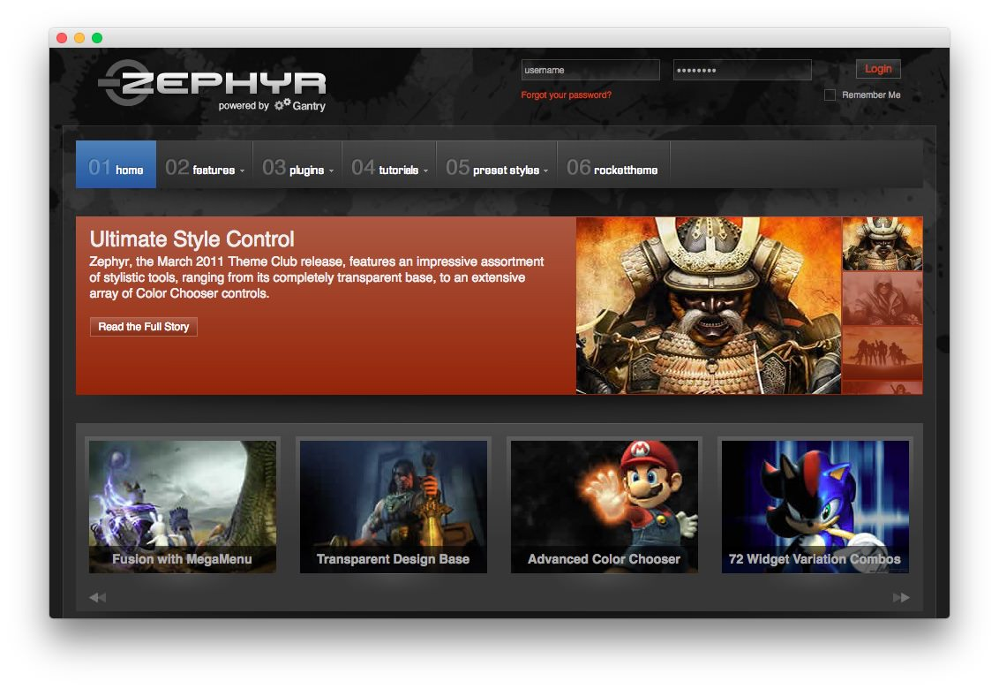
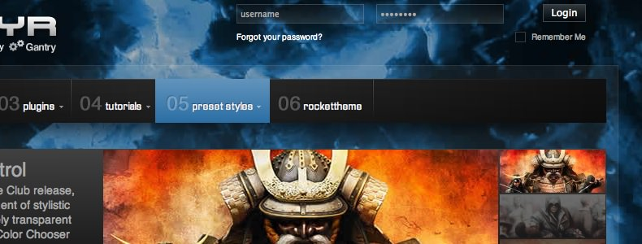
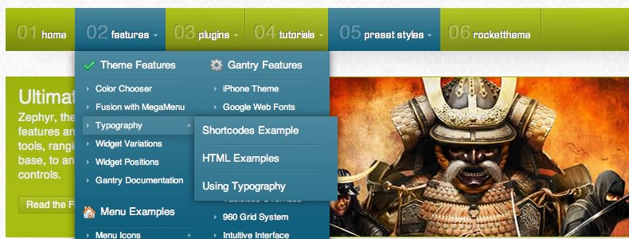

Introduction
------------

Zephyr features an impressive assortment of stylistic tools, ranging from its completely Transparent Base, to an extensive array of Color Chooser controls. It sports twelve preset style variations and 24 widget class suffixes to diversify your page content.

Requirements
------------

* Gantry 4 Framework
* FF, Safari, Chrome, Opera, IE8+
* PHP 5.2.17+ (5.3+ recommended)
* WordPress 3.2+, 4.0+

> > NOTE: An updated version of RokCommon is required for Zephyr to work properly. For more details on the Gantry Framework, please visit its [Dedicated Website](http://www.gantry.org/).

Key Features
------------

* 960 Fixed Layout
* 12 Preset Styles
* 68 Widget Positions
* 24 Widget Variations
* Fusion-Menu and Split-Menu
* Custom Typography
* iPhone Theme
* iPhone Menu
* Static CSS Option
* Fixed Footer Option

### Compact Login

A uniquely styled feature is the horizontal login in the header area. The styling is automatically applied, without the need for a widget suffix, which transforms the vertical login widget into a compact, singular lined login, perfect for displaying in space-conscious zones.

### Fusion Menu

The Fusion Menu is an advanced, CSS based menu system, which offers a wide range of per menu options, such as: inline subtext, icons, and custom column widths, as well as control over how menu items are distributed between columns.
